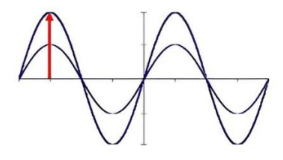
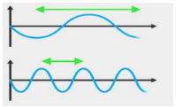
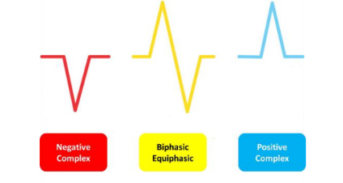
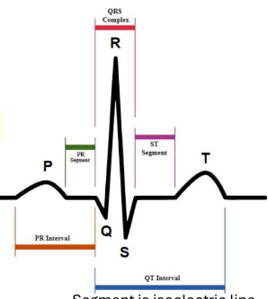
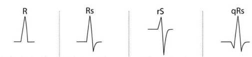
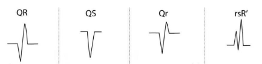
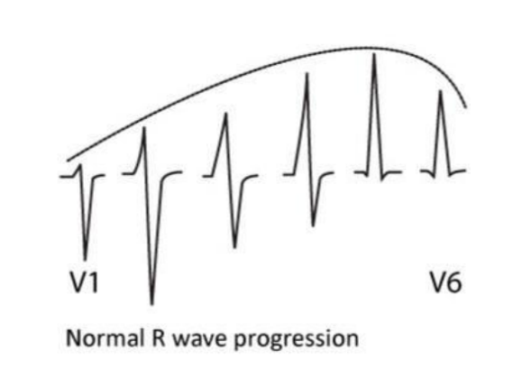
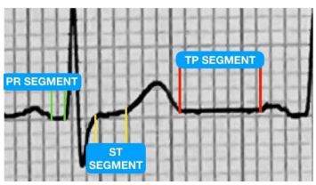
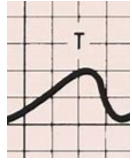
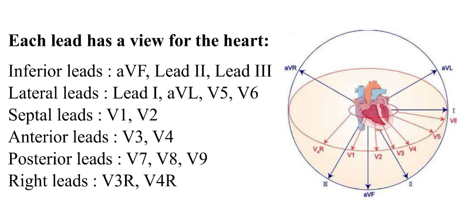

# Ecg Basics

## measuring heart electricity (3 major things)

1. ### **strength of electricity:**
    by the wave length <mark>(amplititude)</mark>

    

2. ### **speed of electricity:**
    by the wave duration (how many small boxes), for example narrow wave indicates high speed electricity

    

3. ### **Direction of electricity:**
    - positive wave if moving away from electrode
    - negative wave if moving towards the electrode
    - equiphasic (+ve = -ve) when perpendicular عمودي on electrodes

    

> [!NOTE] 
> atriums and ventricles are separated from each other by a fibrous tissue, so atriums electricity can never reach the ventricles and vice versa except <mark>via عبر AV-Node</mark>

### ionic distribution inside and outsid cardia cells

- intra-Cardiac-Cellular have high concentration of +ve ions like <mark>postassium</mark> and -ve ions like <mark>Bicarb and proteins</mark>
- extra-Cardiac-Cellular have high concentration of +ve inons like <mark>sodium, clacuim</mark> and -ve ions like<mark>cloride</mark>

> [!NOTE]
> - SAN and AVN are depolrized using rapid influx of <mark>Calcuim</mark> so the velocity of conduction in SAN and AVN depends on calcuim
> - while the cardic cells are depolarized using <mark>sodium</mark> so the velocity of conduction in cardiac muscles depends on sodium

ال san وال avn شغالين لوحدهم من غير اي اثاره لان في قناه اسمها funny channels or (IF Channels) ودي بتسمح ل ايونات الصوديوم انها تدخل وحده وحده تاني الخليه بعد ما ال depolarization يخلص فبدل ما يكون فيه فترة recovery او الفتره اللي هي الخليه مبتقبلش فيها اي stimulants زي فال cardiac cells or any other cells لا ده هنا فال san على طول بعد ال depolarization عن طريق ال funny channels الصوديوم هيدخل وحد وحده لحد ما ال SAN ت fireUp تاني 

there is the funny channels “if channels” which helps in slow sodium influx, these channels are responsible for the spontaneous depolarization of the SAN, that’s why we call it <mark>Automatic cells</mark>.

> [!TIP]
> <mark>procoralan(Ivabradine)</mark> is a medicine used for <mark>tachycardia</mark>, As it works on If channels by preventing Na influx leading to decrease SAN firing.

> [!NOTE]
> electricity moves from -ve to +ve

### Ecg leads
- the black electrode (on the right foot)(indifferenct electrode) is negligible
- they are <mark>12</mark> in totoal
    - <mark>6</mark> coronal leads
        - 3 bipolar leads
            - lead-1 between <mark>right and left arms</mark>
            - lead-2 between <mark>right arm to left foot</mark>
            - lead 3 between <mark>left arm to left foot</mark>
        - 3 unipolar leads (augmented vector leads)
            - AVR from <mark>center of the body to right arm</mark> (right arm is the +ve) 
            - AVL from <mark>center of the body to left arm</mark> (lfet arm is the +ve) 
            - AVF from <mark>center of the body to left foot</mark> (left foot is the +ve)
    - <mark>6</mark> chest leads (unipolar)

### ECG paper
- each big square has 5 small squares
- 300 big square = 1 minute
- 5 big square = 1 second
- 1 big square = 0.2 second
- 1 small sqare = 0.04 second = 1 mm
- 1 ml volt = 2 big square = 10 small square عمودي (amplititude)
- samll square = 0.1 ml vlot

    ### **waves:**

    
    
    - P wave (atrial depolarization) its width and hight is <mark>not more that 3 small squares (2.5 mm * 2.5 mm)</mark>
    - PR segment (AVN delay) 
    - PR interval (P + PR) <mark>3 - 5 small squares</mark>
    - QRS (ventricular depolarization) <mark>2.5 mm wide, 5 small squares hight in limb leads (lead-1, lead-2, lead-3, AVR, AVL, AVF) or 10 small squares hight in chest leads</mark>
    - T (ventricular repolarization)
    - ST segment
    - QT interval (from start of Q wave to end of T wave)

    ### **QRS**
    
    qrs wave can be presented with 3 morphologies
    - monophasic (one wave only)
    - biphasic (2 waves)
    - triphasic (3 waves (the whole QRS exists))

اول موجه باصه ل تحت (-ve) دي دايما ال Q wave, اول موجه باصه ل فوق (+ve) دي دايما ال R wave, اول موجه باصه لتحت بعد ال R wave دي ال S wave و اول موجه باصه لفوق بعد ال S دي اسمها R` بتتنطق R dash ودي بنلاقيها فال right bundel زي ما هنعرف بعدين

**To identify each wave:**

عشان تعرف انهي موجه فيهم ال R وانهي موجه ال S  وانهي موجه ال Q اتبع القاعده دي (هو هو الكلام اللي بالعربي اللي فوق)

- 1st -ve wave = Q
- 1st +ve wave = R
- 1st -ve wave after R = S
- 1st +ve wave after S = R"

> [!NOTE]
> ال QS مجازا سميناها كده بس زي ما انت شايف فالصوره هي فعليا Q بس
### **in chest leads**
- as we move from v1 to v6 -> (R progression بتطول تدريجيا and S Depression بتقصر تدريجيا)
    
    

    ### **j-point and TPline**
    
    المسافه مابين ال T وال p اسمها ال TP line او ال TP segment 
    
    ال j-point دي نهاية ال S wave 
    
    لما ال j-point تكون اعلى من ال TP line اسمها ST elevation
    
    لما ال j-point تكون تحت ال Tp line اسمها ST depression
    
    

    
    ### **Twave**
    
    - T wave is asymmetric meaning its tip is closer to its end than its beggining
    - e:i if you tried to divide it in half from its tip it will be asymmetric

    
    
    - its height is equal to QRS (5 small boxes in limb leads and 10 in chest leads)
    - if T-wave is taller than normal and <mark>symmetric</mark> it is called <mark>hyper-Acute-Twave</mark>
    - if T-wave is taller than normal and <mark>asymmetric</mark> it is called <mark>normal variant T-wave</mark>

### Abnormal ECG 
when you read ecg paper do the following

1. Spot diagnosis (in the future when you become expert)
2. Follow the scheme below to confirm, correct, complete diagnosis

### **Scheme: look for**
    
1. AV block & arrhythmia in <mark>long strip Lead II, V1, V5 <mark>    
2. Atrial enlargement in <mark>Lead II, V1</mark>
3. BBB in <mark>V1,V2,V5,V6</mark>
4. Ventricular enlargement in <mark>V1,V2,V5,V6</mark>
5. Axis & hemiblock in <mark>Limb leads (Lead I, aVF)</mark>
6. Infarction & ischemia: <mark>Wall to wall</mark>
7. Miscellaneous
    - Low voltage
    - Electrolyte disturbances (hypokalemia)
    - Drugs (digitalis)
    - Preexcitation syndrome (WPW)
    - pericarditis

> [!NOTE]
> you can do long strip lead-2 Ecg alone, long strip V1 alone or long strip V5 Ecg alone
> 
### Notes about the procedure
- right side نار و طفيناها
- left side صحرا وخضرناها 
- v1 in 4th right ICS para-sternum
- v2 in 4th left ICS para-sternum
- v4 in midClavicular line (apex) left side
- v3 between v2 and v4 left
- v5 anterior axillary line left side
- v6 mid axillary line left side

في electrode اسمه V3R و V4R دول مكانهم بيكونوا فنفس مكان V3 و V4 عادي بس فال right side

في برضو V7, V8, V9, دول ال posterior leads مكانهم فال 

v7 -> posterior axillary line

v8 -> mid-scapular line

v9 -> para-vertebra 

مقابل ال anterior leads بالظبط
### leads View of the heart

يعني مثلا عندك ST elevation في AVF, LEAD-2, LEAD3 كده ال inferior wall of the heart in the one affected

### REF
Dr mohammed salah [ECG part 1](https://youtu.be/52FDq40l8Eg?si=yks0i10lRaVY3BJU)

-----
