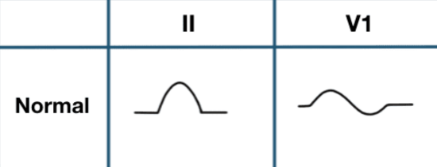
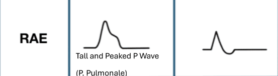
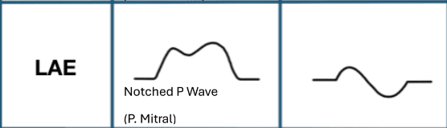
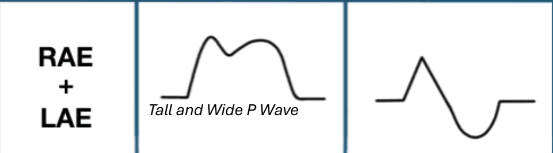

### atrial enlargment
- look in <mark>lead-2</mark> and <mark>V1</mark>
- the first part of the Pwave represents right atrium contraction, and the second part represents the left atrium contraction
- Normally the P wave in Lead II is<mark> 2.5 mm long and 2.5 mm</mark> wide. While in Lead V1, the P wave is <mark>biphasic and 1 mm long</mark>
- the biphasic shape of Pwave in V1: the +Ve part is right atrium contraction and the -ve part is the left atrium contraction

### right atrium enlargment (P-pulmonale)
- first half of Pwave is taller than 2.5 small boxes in lead-2, second half is normal
- tall +ve Pwave more that 1mm in V1 and normal -ve Pwave 

### left atrium enlargment (P-mitral)
- notched Pwave or wide Pwave in lead-2
- normal +ve Pwave and tall -ve Pwave in V1 more that 1mm

### Bi-atrial enlargment
- tall and notched (wide) Pwave in lead-2
- tall +ve and -ve Pwaves in V1

> [!NOTE]
> - if right or left atrium enlargment cirteria exists in only lead-2, it's enough to confirm it even when not present in V1, sometimes also you may see right atrium enlargment in lead-2 and left atrium enlargment in V1, in this case also you can diagnose it as Bi-atrial enlargment
> - Right and Left Atrial Enlargement can be diagnosed using 1 lead only, either lead II or Lead V1.
> - Bi-Atrial Enlargement can be diagnosed by <mark>a)</mark> Presence of tall, wide and pitched P wave in lead II. <mark>b)</mark> Presence of Right Atrial Enlargement P wave abnormality in one lead and Left Atrial Enlargement in the other lead.

### Causes of Right Atrial Enlargement 
1. Tricuspid Stenosis
2. Tricuspid Regurge
3. Right Ventricular Failure
4. Atrial Septal Defect (ASD)
### Causes of Left Atrial Enlargement
1. Mitral Stenosis
2. Mitral Regurge
3. Left Ventricular Failure
4. Ventricular Septal Defect (VSD)
