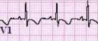
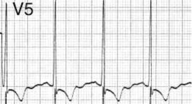
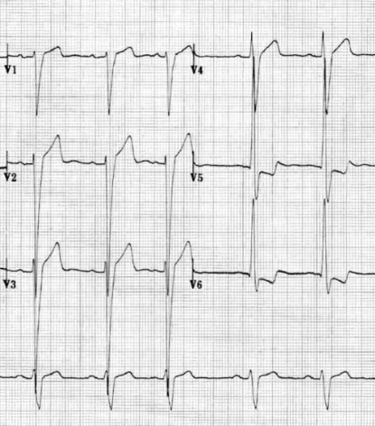
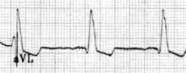
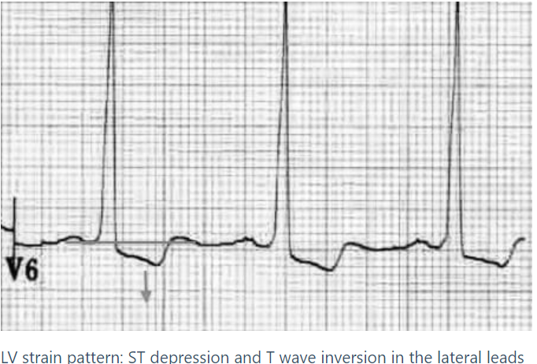
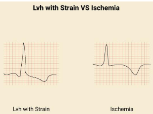

### ventricular enlargment
- look in lead <mark>V1</mark> and <mark>V5, V6</mark>

### <mark>Right</mark> ventricular enlargment
- <mark>tall R-wave more that 7 small boxes</mark> in **V1**
- <mark>R:S ratio more than 1</mark> (meaning Rwave height = Swave height) in **V1**

### <mark>left</mark> ventricular enlargment
- <mark>R-wave > 5 large squares (25mm)</mark> in **V5/6**

- **V5** R-wave + **V1** S-wave <mark>> 7 large squares (35mm)</mark>

- **V5** R-wave + **V2** S-wave <mark>> 9 small squares (45mm)</mark>
- **V6** R-wave is <mark>taller</mark> than **V5** R-wave
- **AVL** R-wave <mark>more than 11 mm</mark> in femals or <mark>13 mm</mark> in males = 2.2 large boxes

> [!NOTE]
> - enlargment keyword can mean either Hypertrophy or Dilation, in order to specify whether the enlargment is due to hypertrophy or dilation look for the <mark>strain Pattern</mark>, which is defined as <mark>ST depression that is Coved</mark> (hypertrophy)

**defferentiate with ST depression ischemia**

> [!NOTE]
> any wide QRS usually followed by inverted Twave

### Bi-Ventricular Enlargement
- Signs of Left Ventricular Enlargement + Tall R Wave in V1.
- Signs of Left Ventricular Enlargement + Right Axis Deviation.

### Causes of Right Ventricular Enlargement 
1. Overload
    - Pressure
        - Pulmonary Hypertension
        - Pulmonary Stenosis
    - Volume
        - Tricuspid Regurge
        - Atrial Septal Defect
3. Right Ventricular Failure

### Causes of Left Ventricular Enlargement
1. Overload
    - Pressure
        - Hypertension
        - Aortic Stenosis
        - Aortic Coarctation
    - Volume
        - Mitral Regurge
        - Aortic Regurge
        - Ventricular Septal Defect
2. Left Ventricular Failure

### Ref
Dr mohammed salah [ECG part 2](https://youtu.be/FKHwLrwsG_4?si=p7QC9XIojXwrnfGD)

-----