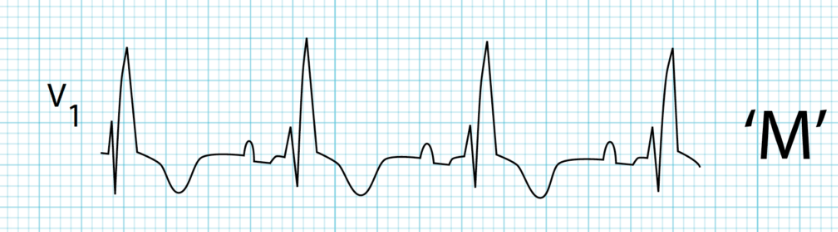
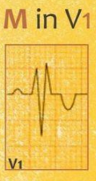
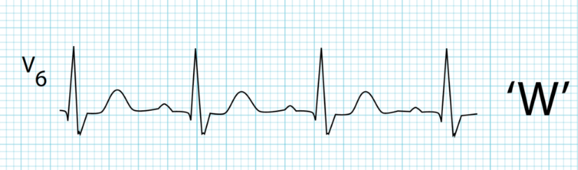
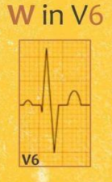
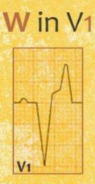
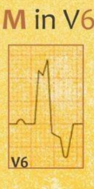

### Bundles Blocks
they are **3 types**
1. left bundle Brach Block (LBBB)
2. right bundle Brach Block (RBBB)
3. inter-ventricular conduction delay (IVCD)

> [!IMPORTANT]
> to diagnose any type of bundle branches block, <mark>QRS</mark> must be <mark>wide</mark>, because there is a delay in the conduction, so this is the first thing to look at, if QRS is not wide exclude Bundel block

> [!NOTE]
> the <mark>"Block"</mark> word in the term Brach Block, it doesn't mean an actual Block!, it means only a <mark>Delay</mark>

### qrs
- normal qrs **width** is <mark>2.5mm</mark>
- <mark>2.5mm - 3mm</mark> is **incomplete** bundle branch block
- <mark>> 3mm</mark> is **complete** bundle branch block

### Branches Block
look in <mark>V1, V2, V5, V6</mark>

### right bundle Brach Block (RBBB) (M-shaped, W-shaped)
- QRS is <mark>M-shape</mark> in **V1** and <mark>W-shape</mark> in **V6**
- **V1**, **V2** there is <mark>wide RSR-dash pattern</mark> (M-shaped, rappit ear) or wide RSR-dash and the R-dash part is wider

- **V5**, **V6** slurred **S-wave** <mark>(wide)</mark> (W-shaped)

### left bundle Brach Block (LBBB)
- in **V1**, wide -ve QS

- in **V6** <mark>notched wide +ve R</mark> (M-shape)

### inter-ventricular conduction delay (IVCD)
-  it is when RBBB criteria exist in one lead(V1, V2, V5, V6), and LBBB criteria exist in the other lead e:g M-shape in V1 and M-shape also in V6 or QS in V1 and slurred-S in V6

### Causes of Right Bundle Branch Block

1. Right Ventricular Enlargement
2. MI (Inferior STEMI)
3. Rate Dependent (Tachycardia)
4. Normal (not uncommon)

> [!NOTE]
> RBBB in STEMI patient has a very poor prognosis

### Causes of Left Bundle Branch Block

1. Left Ventricular Enlargement
2. Ischemic Heart Disease, MI
3. Rate Dependent (Tachycardia)
4. Normal (Rare)

### Causes of IVCD
1. myopathy (MyoCardial injury)
2. hyper-kalemia

> [!NOTE]
> the septum is depolarized by the left Bundle

-----