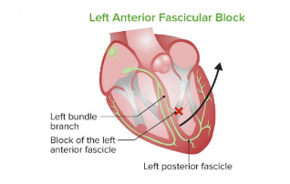
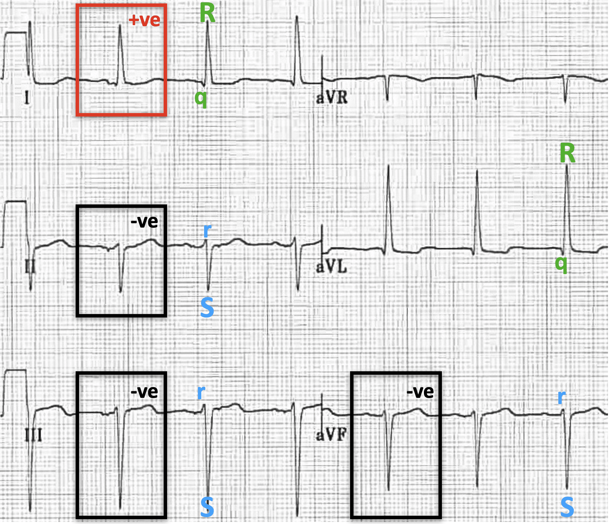
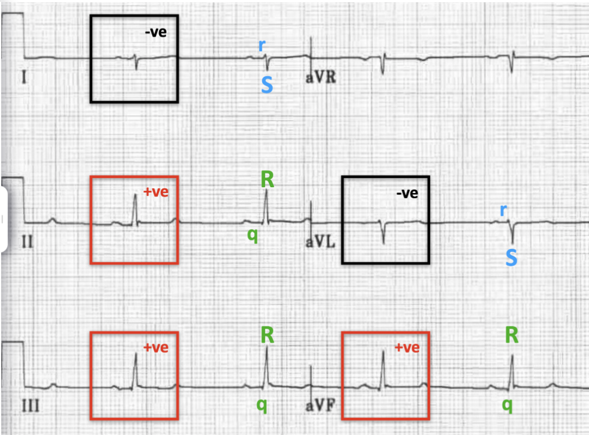

### Hemi-Block
- left bundle before dividing into birkingi fibers, it actually divides first to <mark>left anterior fascicle</mark> and <mark>left posterior fascicle</mark>

- look in <mark>limb leads</mark> (lead-2, lead-3, AVF)

### left anterior Hemi-block (LAH)
- it's when the left anterior fascicle is the one affected 

- <mark>-ve QRS</mark> in **inferior leads** (lead-2, lead-3, AVF)

### left posterior Hemi-block (LPH)
- <mark> -ve QRS</mark> in **lead-1** and **AVL**

