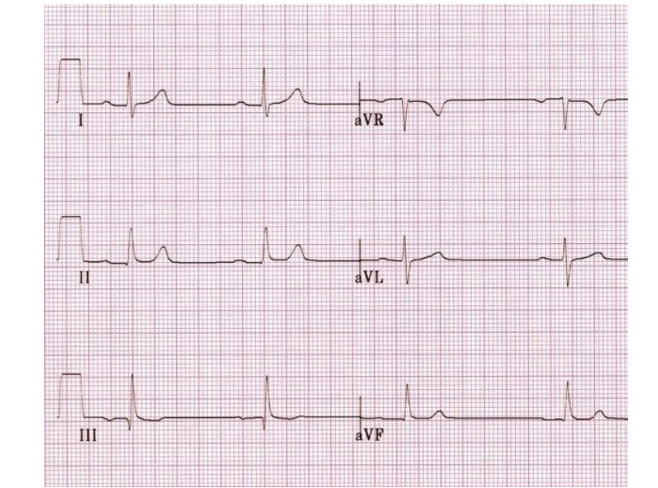
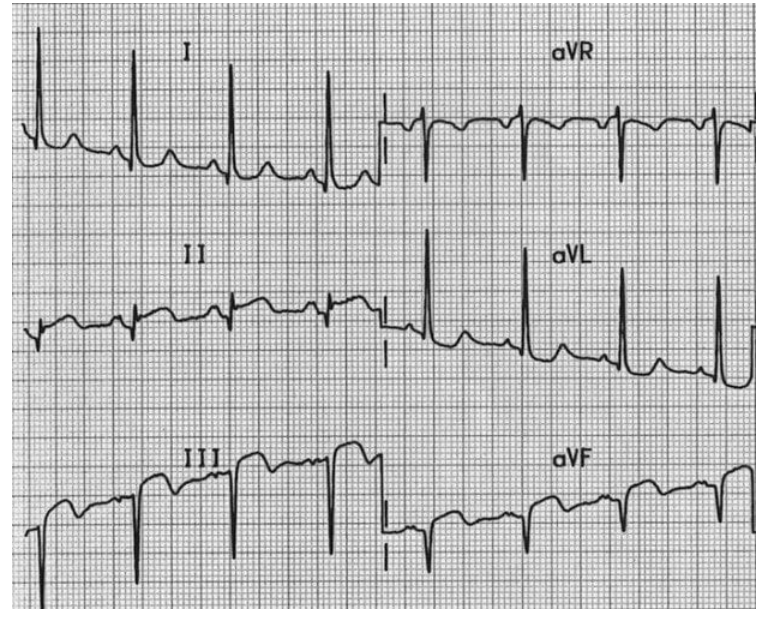
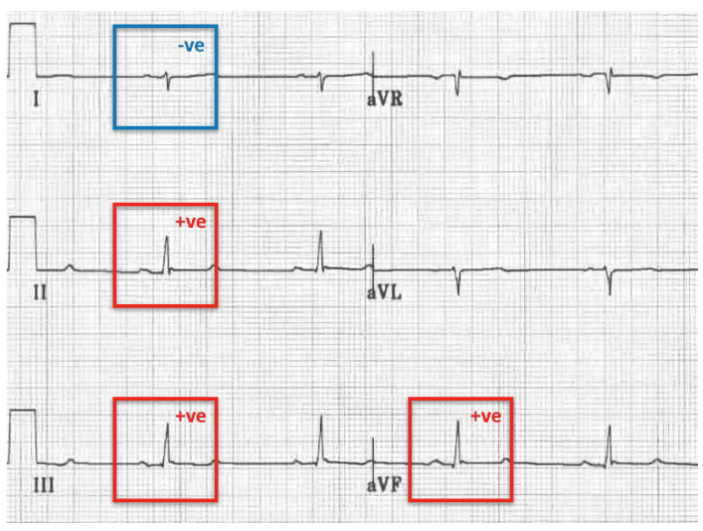
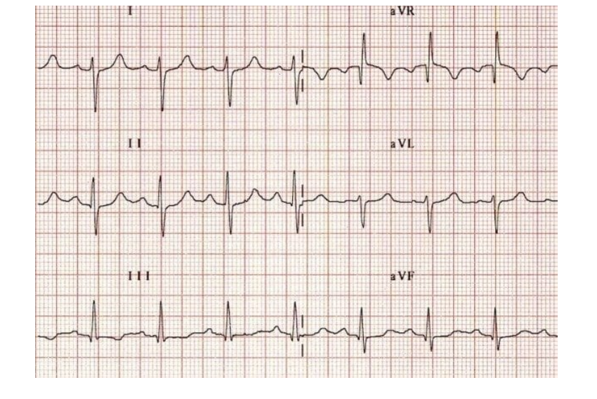
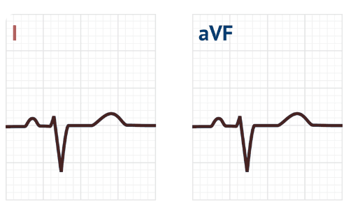

### axis deviation
- look in limb leads <mark>lead-1 and AVF</mark>
- when QRS axis is +ve in both lead-1 and AVF is called <mark>normal axis</mark>

### Left axis deviation
- when QRS axis is <mark>+ve in lead-1</mark> and <mark>-ve in AVF</mark>

### Right axis deviation
- when QRS axis is <mark>+ve in AVF</mark> and <mark>-ve in lead-1</mark>

### Extreme axis deviation
- when QRS axis in both <mark>lead-1 and AVF</mark> are <mark>-ve</mark>

----------