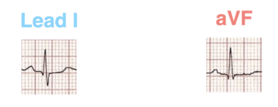
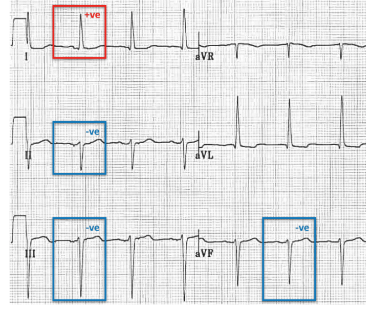

### axis deviation
- look in limb leads (lead-1 and AVF)
- normal axis is when QRS is +ve in both lead-1 and AVF

### Left axis deviation
- when QRS axis is +ve in lead-1 and -ve in AVF

### Right axis deviation
- when QRS axis is +ve in AVF and -ve in lead-1

### Extreme axis deviation
- when QRS axis in both lead-1 and AVF are -ve

