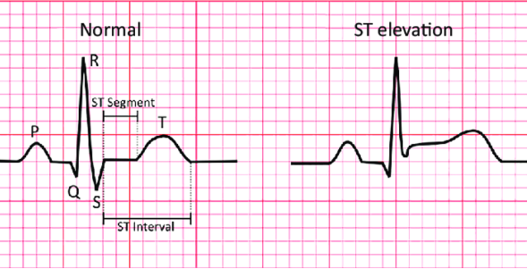
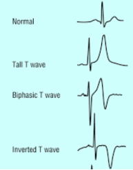
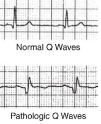
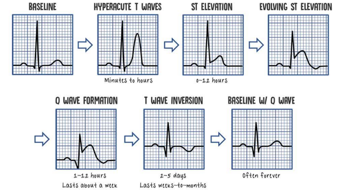
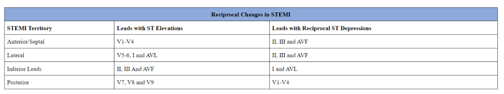

### myocardial infarction
- look for: <mark>wall to wall</mark>

> [!IMPORTANT]
> - when MI occurs, there is 2 main things occur
>   - first is <mark>repolarization changes</mark> represented by **ST-elevation and T-wave Changes**
>   - later is <mark>depolarization changes</mark> represented by **Pathological Q wave** after repolarization

### Repolarization changes
1. **ST elevation**: due to myocardial injury

2. **T-wave changes**: due to peripheral ischemia, which may be represented as:
    - hyperacute
    - biphasic
    - symmetrically inverted

### Depolariztation changes
- **pathological Q**: represents the necrosis
    - occur after the repolarization and represents the necrosis aspect of the disease 

> [!TIP]
> - first ecg change occurs in MI is <mark>ST-elevation</mark> represents cells injury, then <mark>T-wave changes</mark>representing ischemia, and finally the <mark>pathological Q-wave occur</mark> representing the necrosis (MI)
> - when interpreting MI, determine <mark>age</mark> of infarction (old, new), <mark>site</mark> of the infarction (according to leads), and <mark>size</mark>

### infarction age
1. **Hyperacute phase**:  (0-6 Hours)
    - ST Elevation
    - Hyperacute T Wave
2. **Acute (Evolved Phase)** (6-24 Hours)
    - Pathologic Q Wave Appears
    - ST Elevation
    - Biphasic T Wave
3. **Subacute phase** (24 Hours – 3 Weeks)
    - Pathologic Q Wave
    - Inverted T Wave
4. **Chronic phase** (> 3 Weeks)
    - Pathologic Q Wave only

### infarction site

### size
**Determined using three items**- 
- Height of ST Elevation
- Numbers of Leads Showing STEMI
- Leads showing reciprocal T wave changes: for example anterior leads ST-elevation will also show posterior leads ST-Depression, so if ante

> [!NOTE]
> - reciprocal T-wave changes mean that whenever you have ST-elevation in some leads you will also have ST-Depression in the opposite leads
> - for example ST-elevation in anterior leads would show ST-Depression in the Posterior leads
> - what if you have ST-Depression in the anterior leads? you should do <mark>posterior leads</mark> ecg as the ST-depression in the anterior leads may be a reflection of Posterior STEMI