### arrhythmias
- look to long strips <mark>lead-2, V2, V5</mark>
- loof for <mark>regularity, rate, and pacemaker</mark>

### Regularity
- regular
- irregular
- Regular with occasional irregularity

### Rate
- **if regular**:
    - 300/ no. of big squares between two R-waves.
    - 1500/ no. of small squares between two R-waves.
- if irregular
    - no. of QRS in 30 big square × 10

### pacemaker
1. **SAN** (sinus rhythm)
    - P wave in Lead-2 is upright(+ve)
    - P wave in AVR is inverted(-ve)

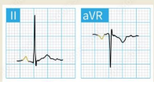

2. **AVN** (junctional) 
    - Absent P waves
    - Retrograde
        - Inverted in Lead-2 (-ve)
        - Upright in AVR(+ve)
    - retrograde may be before or after QRS

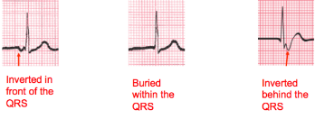

3. **Atrial**
    - No sinus P wave
    - present of Small P-wave that may be biphasic or inverted
    - this small atrial foci it has 2 types:
        - Atrial ectopic focus
        - Multiple foci: which is the main responsible for, AFib & AFlutter & MAT & WAP

### Atrial fibrillation A-fib
- due to multiple focus
- characterized by multiple small p-waves that variable in size and direction

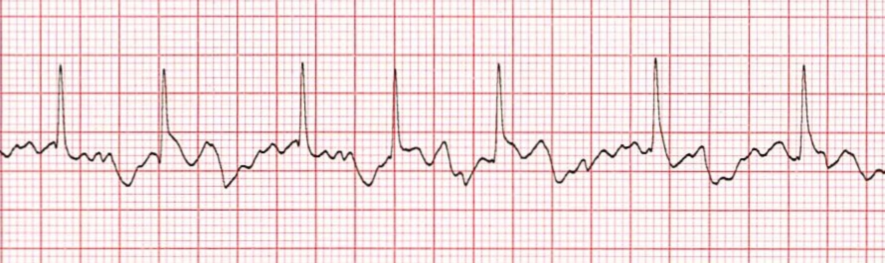

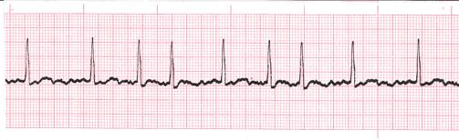

### Atrial flutter (AF)
- Saw teeth appearance
- Multiple Large p-wave, Uniformed in size and direction
- Constant number of P waves between each QRS is called **constant degree of block**
- Variable number of P waves between each QRS is called **Variable degree of block**

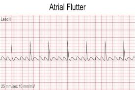

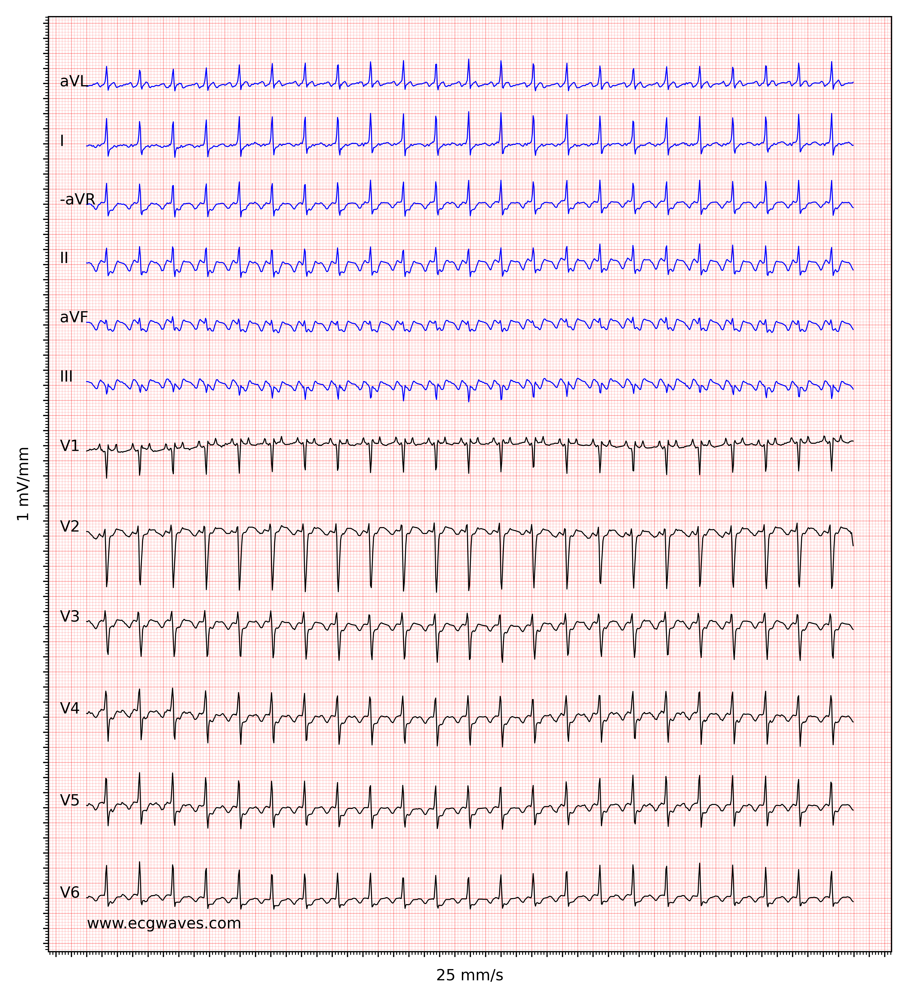

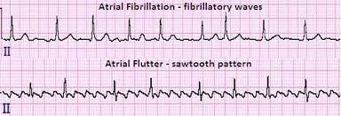

### Multifocal atrial tachycardia
- 3 different types of P wave in shape, size, direction or more
- High HR more than 100 bpm (tachycardia)

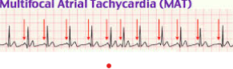

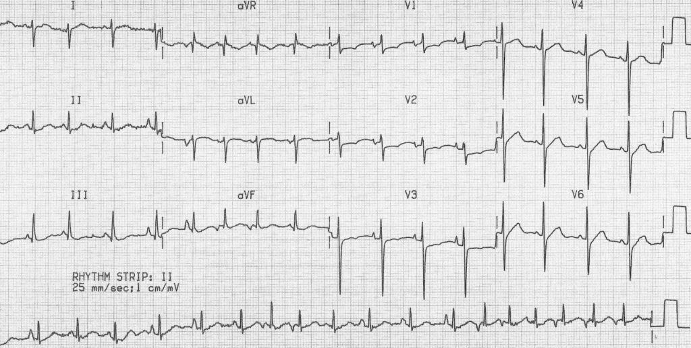

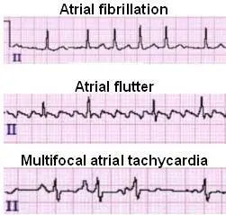

### Wandering atrial pacemaker
- 3 different types of P wave in shape, size, direction
- low HR or normal

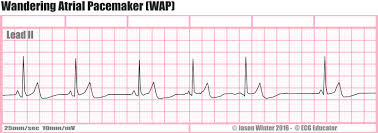

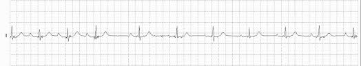

4. **ventricular**
- wide QRS wide with opposed T wave direction (against QRS) e:g when qrs is +ve T is -ve
> [!NOTE]
> you can think of this as a rule that must happen, whenever you have wide QRS the following T-wave would be in the opposite direction
- Signs of AV dissociation الاذين شغال مع نفسه والبطين مع نفسه
    - P rate is different from QRS rate
    - P wave haphazardly on QRS
    - Capture beat with fusion beat
> [!NOTE]
> - capture beat with fusion beat means that you will find one normal width QRS between all the wide QRS
> - in more details it means that there is an abnormal beat that comes from ventricle as wide QRS and a normal beat, both of them infuse together and appear as one normal QRS between the multiple wide QRSs
> - Capture beat: Normal QRS in between the Wides
> - Fusion beat: Normal QRS fused with the wide one causes QRS wider than normal and narrower than the Ventricular

