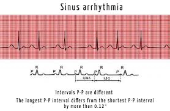
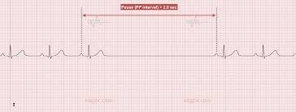
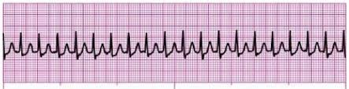
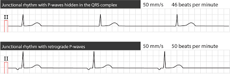
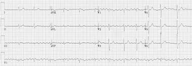
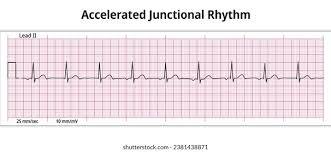

### Arrhythmias

### Sinus rhythm
- meaning the pacemaking is comming from the SAN (knows by qrs +Ve in lead-2 and -ve in AVR)
- after knowing the pacemaker now we will look for the rate and regularity
    - **Normal sinus rhythm**
        - Regular
        - rate 60: 100 bpm
    - **Sinus tachycardia**
        - Regular
        - rate > 100 bpm
        - exercise, emotional stress, low CO by blood loss, renal failure , fever, hyperThyrodism
    - **Sinus bradycardia**
        - Regular
        - rate < 60 bpm
        - normally in athelete, myxedema, hypothyrodism, betablocker, sleep, <mark>ICP</mark>
    - **Sinus Arrhythmia**
        - irregular
        - occur normally with deep inspiration

        
    - **Sinus pause**
        - irregular
        - also called (sick sinus syndrome) (droped beat)
        
        

### Junctional rhythm
- pacemaking is comming form AVN (know by no Pwave, Pwave -ve in lead-2 and +ve in AVR and Pwave comes after or before QRS)
    - **Supraventricular tachycardia** (SVT) (Junctional tachycardia)
        - Regular
        - R > 100 bpm

        

    - **Escape junctional rhythm**
        - Regular
        - R < 60 bpm

        

        

    - **Accelerated junctional rhythm**
        - Regular
        - R 60: 100 bpm

        

### Atrial rhythm
- Pwave is not sinus, small, biphasic or inverted
    - **Supraventricular tachycardia**
        - bizzare Pwave
        - Regular
        - R > 100 bpm
    - **Atrial fibrillation**
        - MAF(multiple atrial foci)
        - lost p wave (fibrillatory waves)
        - R is 60: 110 bpm (controlled)
        - R is > 110 bpm (A-fib with rapid rate)
        - R < 60bpm (slow A-fib)
        - hypertension, mitral valve disease, heart failure, hyperthyrodism, cardiac surger
    - **Atrial flutter** (Macro reentry tachycardia)
        - Comes from Cavo tricuspid isthmus
        In <mark>Lead-2 & Lead-3 & avF</mark>(inferior leads)
        - Flutter wave (Saw teeth)
        - Regular (4 to 1 & 2 to 1)
            - 4 to 1 (4-Pwaves then 1 QRS)
            - 2 to 1 (2-Pwaves then 1 QRS)
        - Irregular (Variable block)
        - Any rate
    - **Multifocal atrial tachycardia**
        - 3 different types of P wave in shape, size, direction or more
        - High HR more than 100 bpm
        - in COPD
    - **Wandering atrial pacemaker**
        - 3 different types of P wave in shape, size, direction
        -  HR / normal HR
        - In sick sinus syndrome

### Ventricular rhythm
- wide QRS wide with opposed T wave direction and signs of AV dissociation
    - **Ventricular tachycardia** (VT)
        - R > 150 bpm
        - Regular / Irregular
        - unifocal if all has the same shape
        - multifocal if not(danger can progress to VF)
        - Bidirectional (digoxin toxicity)
        - Torsade’s de pointes (respond perfectly to Mg-sulfate)
    - **Ventricular Fibrillation**
        - Lost QRS, Ventricular fibrillation waves
        - Irregular
        - Any rate
    - **Ventricular flutter**
        - Regular and very rapid (250 : 350 bpm)
    - **Escape idiopathic Ventricular rhythm**
        - R < 40 bpm
    - **Accelerated Idiopathic ventricular** rhythm (AIVR)
        - Most common Arrhythmia for reperfusion (when cathetarization of coronaries ther surgeon sees this in monitor indicating reperfusion success)

### forms of cardiac arrest:
- VF
- Asystole 
- Electromechanical dissociation
