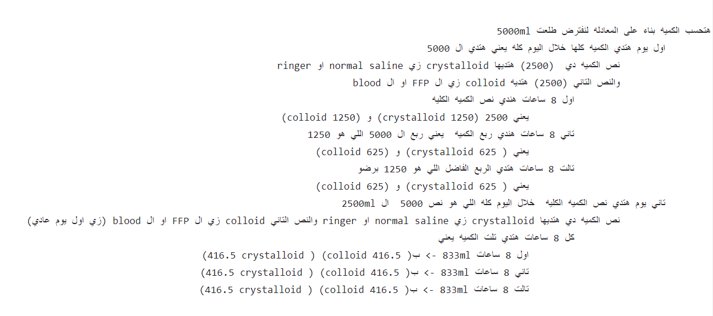

### when you assess a burned patient consider the following
1. **causative agents**
	ask -> what happened? how did you burn yourself ?
2. **depth**
	1. **superficial partial thickness 1st degree**
		- by sunburn or low intensity flash حروق الشمس من المصيف مثلا
		- epidermal only is affected
		- symptoms: <mark>hyperesthesia, pain soothed by cooling</mark> الم بيقل مع البروده او الهوا المائل للبروده
		- wound is <mark>red, blanches with pressure, dry, peeling after one week</mark> الجرح احمر بيبيض لما تضغط عليه وبيتقشر بعد اسبوع تقريبا
		- recovery within week
	2. **superficial partial thickness 2nd degree**
		- epidermal + partial dermis
		- wound is <mark>moist pink(oozing of plasma)</mark> الجرح رطب عشان البلازما بتتسرب, <mark>mottled red painful, blisters</mark> او ممكن البليستر تتفرقع
		- recovery within 3 weeks
	3. **deep partial thickness 2nd degree**
		- epidermis and dermis
		- <mark>pain, hyperesthesia, sensitive to cold air</mark> الالم بيزيد عشان الجلد بيبقى حساس اكتر
		- wound is <mark>mottled red or pearly white</mark>, difficult to differentiate from full thickness الجرح احمر, لو وصل لل فات هيبقى ابيض
		- recovery 3-6 wks
	4. **full thickness 3rd degree**
		- epidermis, dermis, fats, muscles and bone
		- wound is <mark>dry white, cherry red, brown or black</mark> الجرح هنا هيبقه ابيض او احمر نبيتي غامق او اسود
		- <mark>pain free</mark> الاعصاب ماتت ف مش هيحس ب الم
3. **extent of burn**
	- palm method 1% (palm of patient)->use if many small scattered areas are burned 
	- rule of nine دي اللي بنستخدمه
	- lund and browder for pediatric patients
4. **severity**
	1. **minor**
		- < 15% of TBSA
		- full thickness < 2%
		- burns don't present in cosmetic areas
	2. **moderate**
		- 15-25% of TBSA
		- full thickness 2-10%
		- don't present in cosmetic areas
	3. **major**
		- 25% of TBSA (systemic effect)
		- full thickness > 10%
		- burns present in cosmetic areas

# pathophysiology

- burn -> increase histamine -> increase capillary permeability -> loss of plasma -> decrease blood Pressure -> hypovolemic shock -> reduced CO -> thready pulse and hypotension
- sympathetic stimulation -> vasoconstriction -> cold clammy pale skin
- vasoconstriction -> hypoxia -> anaerobic respiration -> lactic acid production -> metabolic acidosis -> air hunger (increase respiration) + increase lactic acid
- face and neck burn -> inhaled hot air and a lot of carbon monoxide -> laryngeal burn and injury -> laryngeal edema -> mechanical obstruction of the upper air way

> [!NOTE]
> you may not be able to intubate such a patient who has face and neck burn so you do tracheostomy instead

- decrease potassium -> paralytic ileus 
- high histamine and high stress situation -> increase HCL -> gastric and duodenal erosion (curling's ulcer)
- impaired skin integrity -> high risk for infection
- impaired thermoregulation -> hypo or hyperthermia
 
### local effect  pathophysiology
- when: < 25% of TBSA so 1st and 2nd degree cause histamine release -> edema and hypovolemia

### systemic effect pathophysiology
- when: > 25% of TBSA, it can cause multi organ failure if not treated within 48 hrs,  as a compensation renin angiotensinogen system cause release of aldosterone and ADH leading to water and salt retention, cold clammy skin due to peripheral vasoconstriction, decrease UO, hemoconcentration high HCT and HB 
- Hyponatremia or hyperkalemia due to Electrolytes imbalance and fluids shift

## Nursing
1. if you are with the victim when the burn happened do first aid accordingly 
	- move patient from fire source
	- if the patient him self catches fire, roll him in the ground without covering him first with blanket
	- rinse chemicals
2. **emergency phase 24-48hrs** (ABCD)
	- remove clothes and cover him with clean linen
	- replace fluids
		- use consensus formula
			- <mark>2-4 ml `*` body weight in kg `*` TSBA</mark>
			- choose 2 ml for each body weight if only patient is burned, if there is any associated vomiting or - diarrhea consider increasing to 3 or 4 ml
### how to replace fluids:

 
2. **acute phase**
	- healing and diet
	- wound cleaning (hydro Therapy (shower)), and dressing
	- prevent wound infection, PPE
	- wound debridement
	- prevent joint flexion and do ROM to prevent contraction
	- use splints to fix the joint in the atomical position e:g neck collar
	- fasciotomy to prevent edema compartement syndrome
3. **rehabilitative phase**
