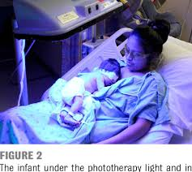

### Hyper-Bilirubinemia

1. **physiological jaundice**
- apear <mark>2nd to 3rd day in term baby</mark> and disapper after <mark>7 days</mark>
- or on <mark>3rd to 4th day in preterm </mark> and disappera after <mark>9-10 days</mark>

2. **pathological jaundice**
- appear on the <mark>first day</mark>, and takes <mark>2-3 week</mark> untill disappear
- bilirubin level <mark>> 12.9mg</mark> in term or <mark> >15mg </mark> in preterm
- daily raise of bilirubin <mark>>5mg</mark>
- TSB (total serum bilirubin)<mark>over the 95th percentile</mark>

> [!NOTE]
> - <mark>acute bilirubin encapholopathy</mark> -> wehn unconjugated bilirubin deposite in brain
> - <mark>kernicterus</mark> -> when permanant neurons injury occured, when level > 25mg/dl

### kernicterus phases
- **phase-1**: poor sucking, hypotonia, lethargy
- **phase-2**: hypertonia, opisthotonos
- **phase-3**: less hypertonia, high pitched cry, poor feeding, athetosis, visual and hearing loss

ف اعمل continous assessment عشان تلاحظ الاعراض دي 

### Diagnostic
- transcutaneous bilirubinometry
- in developing countries -> blood sample of serum bilirubin level

### treatment
- phototheraphy
- exchnage transfusion

### photoTherapy
#### start photo therapy when
- TSB <mark>5-8mg</mark> for infants weight <mark>< 1500g</mark>
- TSB <mark>8 - 12 for</mark> for <mark> 1500gm - 1900gm</mark>
- TSB <mark>11 - 14 for</mark>for <mark> 2000 - 2499</mark>

### Nursing
- **berore**
    - wash your hands
    - baby is naked, except eyes and diapper area
    - adjust lamb 50 cm away form skin
    - monitor lamb effeciency (ensure it works)
- **during**
    - maintain hydration (give fluids)
    - feed the baby (breastFed or bottle), All feeds should be given normally

    

    - assess skin condition: clean with warm water only, change postion, and avoid oily lubricant, monitro and prevent rash and erythema
    - assess eyes for discharge, redness, corneal irritaion
    - close Photo therapy Q4-6 and remove eye shield for 30 minute rest
    - mointor TSB /6-12 hours
    - monitor temperature
    - monitor photoTherapy side effects signs
        - dehydration
        - watery diarrhea
        - retinal damage
        - erythema and skin rashes
        - bronze baby syndrome (resolve after discontinuation of PT)

> [!IMPORTANT]
> turn of the photoTherapy when drawing a blood sample for TSB

- **after**
    - documentation
    - followUp (rebound effect)

### Exchange Transfusion
- removing infant's blood in small amount <mark>(5-10 ml at a time)</mark> and replacing it with compatible blood
- it is a standard mode to treat severs hyperbilirubinemia
- the amount of blood donated to the baby is equal to <mark>85ml/ kg </mark> and never exceeds 500ml

In neonatal hyperbilirubinemia, especially in cases of severe hyperbilirubinemia or jaundice where there's a risk of bilirubin-induced neurologic dysfunction (such as kernicterus), exchange transfusion is sometimes used as a treatment. There are two primary types of exchange transfusion:

### **Single Volume Exchange:**
the replacement of an amount of blood equal to the neonate's blood volume. For neonates, this is roughly <mark>80-90 mL per kilogram of body weight</mark>. During the process, the neonate’s blood is removed and replaced with donor blood or plasma, helping to rapidly decrease the bilirubin levels, it removes <mark>65%</mark> of baby's red cells

**Benefits:**
- Reduces bilirubin levels in the plasma.
- Can remove some of the circulating antibodies if the hyperbilirubinemia is caused by an immune-mediated process like hemolytic disease of the newborn (e.g., Rh or ABO incompatibility).
- Generally used in less severe cases or when rapid reduction is less critical.

### **Double Volume Exchange:**
a volume of blood equal to twice the infant's blood volume <mark>(about 160-180 mL/kg)</mark> is removed and replaced. This is the more commonly used approach for severe cases of neonatal jaundice, as it removes approximately <mark>80%</mark> of the infant’s circulating red blood cells, including those coated with antibodies or producing bilirubin.

**Benefits:**
- More effective in lowering bilirubin levels compared to a single volume exchange.
- Removes a larger proportion of antibodies (in cases of immune-mediated hemolytic jaundice).
- More efficient in clearing bilirubin from the circulation.

**Risks for Both Procedures:**
- **Hypoglycemia:** Due to blood loss and inadequate glucose supply.
- **Electrolyte imbalances:** Especially hypocalcemia.
- **Infections:** As a result of blood transfusions.
- **transfusion reaction**
- **Cardiovascular instability:** Due to volume changes during the procedure.
- **Thrombocytopenia:** A decrease in platelet count can occur.

### Indications for Exchange Transfusion:
- **Severe hyperbilirubinemia** unresponsive to phototherapy.
- **Bilirubin levels** approaching thresholds where there's a risk of kernicterus (usually above 25 mg/dL in term infants, but thresholds vary based on gestational age and other risk factors).
- **Hemolytic diseases**, such as Rh or ABO incompatibility, which lead to rapid increases in bilirubin.

### Procedure technique
بص عالادوات والبروسيدجر ف الفيديو الصغير [ده](https://youtu.be/ReOdmO0K3Dc?si=kag2XBjI81FmXgK7)

### Nursing
- **before**
    - ensure donor blood type and cross matched to the mother's blood
    - keep all resucitation equipment at bedside
    - assess v/s and O2 saturation and NPO
    - start IV line and infuse dexteros and electrolytes
    - procedure is done while baby is under radiant warmer and covered with sterile drapes
    - warm donor blood
- **during**
    - it is a <mark>sterile surgical procedure</mark>
    - monitor signs of transfusion reaction
    - maintain respiratroy and hemodynamic balance
    - maintain fluids and electrolytes balance
- **after**:
    - inspects ubmilical site for bleeding 
    - send aliquot blood to lab for studies
    - documentation of amount of blood withdrawn and infused and the start time and end of the procedure
    - any given medications (e:g calcium gluconate to prevent hypocalcemia)