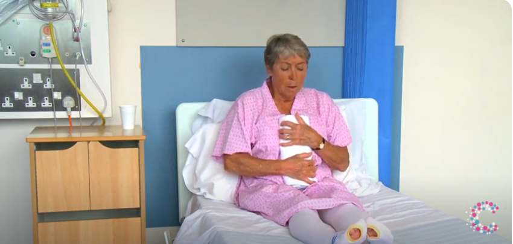
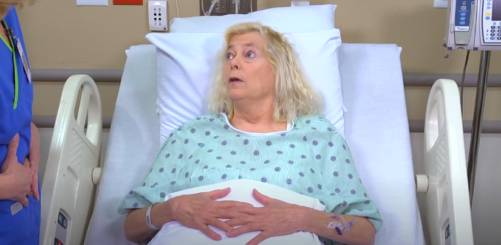
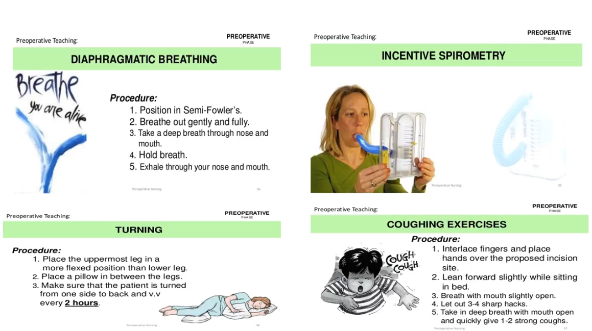

### pre-operative preparation
1. general (physiological, psychological)
2. Health teaching
3. immediate pre-operative preparation

### physiological preparation
1. **manage fluids and fluids**
- just manage and correct all abnormal finding related to nutrition that you encounterd during the assessment phase e:g <mark>reduce obesity, correct electrolytes imbalance</mark>
> [!NOTE]
> some GIT surgeries may require patient to live on fluids only for <mark>3 days</mar> especially <mark> colon surgeries </mark>
2. **promote rest and sleep**
- just use your non-pharmacological nursing intervention to promote sleep e:g <mark>provide well ventilated quite room</mark>
- only use medication if indicated e:g <mark> patient can't sleep with simple measures, anxiety or fear prevents him from sleep</mark>
3. **prepare bowel for surgery**
- enema is not routinely ordered for all surgeries, but it may be used in some major abdominal surgeries for <mark>cleansing purpose, enhancing surgical site visualization and preventing intestinal trauma. it's done <mark> at the evening before surgery</mark>
- gastric tube may be inserted on the morning to decompress stomach (removing its content)
4. **skin preparation**
- shower with <mark> any type</mark> of soap
- use <mark>electric clipper مكنة حلاقه مش موس </mark> to remove hair <mark>immediately before</mark> operation to prevent <mark> surgical site infection</mark>

### CDC Guidelines to prevent surgical site infections
1. only use prophylactic anti-microbial <mark>when indicated (high risk patient)</mark>
2. skin preparation is done <mark>inside the operating room</mark> using <mark> alcohol-based</mark> agent
3. use appropriate hair removal methods (electric clippers)
4. for all patients whether diabetic or not, maintain BGL <mark>less that 200mg/dl during surgery</mark> and maintain <mark>Normothermia</mark>
5. if patient needs blood products, give him. (don't withheld it fearing surgical site infection)

### psychological preparation
1. answer all patient questions (explain detailed pre, intra and post operative periods)
2. divert his attention e:g<mark> music, distraction, imagination</mark>
3. provid spiritual advisor if needed
> [!TIP]
> you can introduce the person undergoing the surgery to a person who has successfully recoverd from the same surgery

### pre-operative Teaching
1. assess patient learnig style and use different methods of teaching according to the desired outcome
2. breathing exercise, coughing excercise and incentive spirometer (**respiration exercise**)
3. early manipulation (**circulation exercise** e:g <mark>ankle flexion, ankle circular movement, press knee on bed</mark>) within <mark> 12 hours </mark> or at the same surgery day <mark>(day zero)</mark>
> [!IMPORTANT]
> if patient needs to cough or going to do couging exercise he should support the surgical wound with his arm or a rolle towel or a pillow

خلي بالك احنا لسه ف مرحلة قبل العمليه ف انت بتعلم المريض يعمل  التمارين دي قبل العمليه فهتقله مثلا: بعد العمليه هيكون جرح العمليه في المكان ده ف عايزك تمسك المخده دلوقتي وتتخيل ان في جرح فالمكان ده وتضغط عليه بالراحه بالمخده وانت بتعمل تمارين الكحه

##### لو عايز تعرف التمارين دي بتتعمل ازاي اتفرج عالفيديو الصغير [ده](https://youtu.be/flIV8c38zDE?si=tNzERhQSeVwu70Ih)

4. **pain management**
- instruct patient to use pain rating scale 1-10
- teach him non-pharma methods
5. pre-operative **fasting period**
- usually from <mark> 6-8</mark> hours

### immediate pre-operative preparation
بكره ان شاء الله هتلاقيه جاهز عشان جضيت 💚