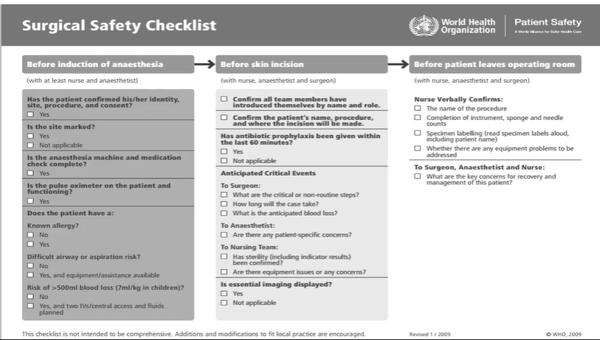

### pre-operative preparation
1. general (physiological, psychological)
2. Health teaching
3. immediate pre-operative preparation

### physiological preparation
1. **manage fluids and fluids**
- just manage and correct all abnormal finding related to nutrition that you encounterd during the assessment phase e:g <mark>reduce obesity, correct electrolytes imbalance</mark>
> [!NOTE]
> some GIT surgeries may require patient to live on fluids only for <mark>3 days</mar> especially <mark> colon surgeries </mark>
2. **promote rest and sleep**
- just use your non-pharmacological nursing intervention to promote sleep e:g <mark>provide well ventilated quite room</mark>
- only use medication if indicated e:g <mark> patient can't sleep with simple measures, anxiety or fear prevents him from sleep</mark>
3. **prepare bowel for surgery**
- enema is not routinely ordered for all surgeries, but it may be used in some major abdominal surgeries for <mark>cleansing purpose, enhancing surgical site visualization and preventing intestinal trauma. it's done <mark> at the evening before surgery</mark>
- gastric tube may be inserted on the morning to decompress stomach (removing its content)
4. **skin preparation**
- shower with <mark> any type</mark> of soap
- use <mark>electric clipper مكنة حلاقه مش موس </mark> to remove hair <mark>immediately before</mark> operation to prevent <mark> surgical site infection</mark>

### CDC Guidelines to prevent surgical site infections
1. only use prophylactic anti-microbial <mark>when indicated (high risk patient)</mark>
2. skin preparation is done <mark>inside the operating room</mark> using <mark> alcohol-based</mark> agent
3. use appropriate hair removal methods (electric clippers)
4. for all patients whether diabetic or not, maintain BGL <mark>less that 200mg/dl during surgery</mark> and maintain <mark>Normothermia</mark>
5. if patient needs blood products, give him. (don't withheld it fearing surgical site infection)

### psychological preparation
1. answer all patient questions (explain detailed pre, intra and post operative periods)
2. divert his attention e:g<mark> music, distraction, imagination</mark>
3. provid spiritual advisor if needed
> [!TIP]
> you can introduce the person undergoing the surgery to a person who has successfully recoverd from the same surgery

### pre-operative Teaching
1. assess patient learnig style and use different methods of teaching according to the desired outcome
2. breathing exercise, coughing excercise and incentive spirometer (**respiration exercise**)
3. early manipulation (**circulation exercise** e:g <mark>ankle flexion, ankle circular movement, press knee on bed</mark>) within <mark> 12 hours </mark> or at the same surgery day <mark>(day zero)</mark>
> [!IMPORTANT]
> if patient needs to cough or going to do couging exercise he should support the surgical wound with his arm or a rolle towel or a pillow

خلي بالك احنا لسه ف مرحلة قبل العمليه ف انت بتعلم المريض يعمل  التمارين دي قبل العمليه فهتقله مثلا: بعد العمليه هيكون جرح العمليه في المكان ده ف عايزك تمسك المخده دلوقتي وتتخيل ان في جرح فالمكان ده وتضغط عليه بالراحه بالمخده وانت بتعمل تمارين الكحه

##### لو عايز تعرف التمارين دي بتتعمل ازاي اتفرج عالفيديو الصغير [ده](https://youtu.be/flIV8c38zDE?si=tNzERhQSeVwu70Ih)

4. **pain management**
- instruct patient to use pain rating scale 1-10
- teach him non-pharma methods
5. pre-operative **fasting period**
- usually from <mark> 6-8</mark> hours

### immediate pre-operative preparation
اتاكد من اسم المريض وال identification band فيتله, اتاكد انه NPO 8 ساعات , بص على ال informedConsent اتاكد انها موجود وممضيه, وان كل التحاليل اللازمه و ورق المريض موجود واي اكياس دم اتطلبتله موجوده ف مكانها وسهل توصلها عند اللزوم

قله يدخل الحمام يفضي المثانه, لبسه الجاون, قلها تشيل اي توكه لابسها او بنسه او اي حاجه حاطاها ف شعرها , قلها تلم شعرها ولبسها ال cover head, المفروض من قبل يوم العمليه ده انت قايلها متجيش ب اي makeup او مناكير, لو لابسه طقم اسنان او اي مجوهرات او اي مثبت مثلا في الفم بنشيله

هتحضر ال skin زي ما ال CDC فالتلك ب alcohol-based-solution و هتحلق ب مكنة حلاقه ف اوضة العمليات لو المريض محتاجين نحلقله مكان العمليه, فالمرحله دي برضو ممكن تركبله كانولا 

احيانا ممكن يكون مطلوب enema او GastricTube عشان تفضي المعده , فالاغلب دول هتعملهم وانت بتقول للمريض يروح الحمام يفضي المثانه تكون عامله enema قبلها مثلا بحيث يعمل evacuation of intestine كمان 

بالانجليزي بقى 😂💚

done on the day of surgery
1. verify identification band, take V/S and assess anxiety, verify NPO, informed consent is signed, all laboratory records exist, blood products is available, have him to empty his bladder and and answer any concerns
2. make p.t wear hospital gown, have her/him to braid long hair يلم شعره, remove hairPins, nail polish, dentures, jewelry and wear coverhead
3. complete skin preparation e:g <mark>shaving with electric clipper, alcohol based disinfection</mark>
4. carry out any special order e:g <mark>enema, GI tube, IV line</mark>

### when to use informed consent
1. invasive procedures e:g <mark>surgical incisions, endoscope operations, paracentesis, blood transfusion</mark>
2. procedures requiring sedation and anesthesia
3. non-surgical procedures e:g <mark>arteriography</mark>
4. procedures involving radiation

### pre-anesthetic medication
- administred <mark>half an hour before surgery</mark> or <mark>night before</mark>, it serves different purposes بتخدم احتياجات متنوعه عند المريض , e:g <.<mark>anxiolytics, analgesics, PPIs, sedatives, anti-emetics</mark>
- **anti-sialagogues** reduces respiratory tract secretions

### who surgical safety checkList

