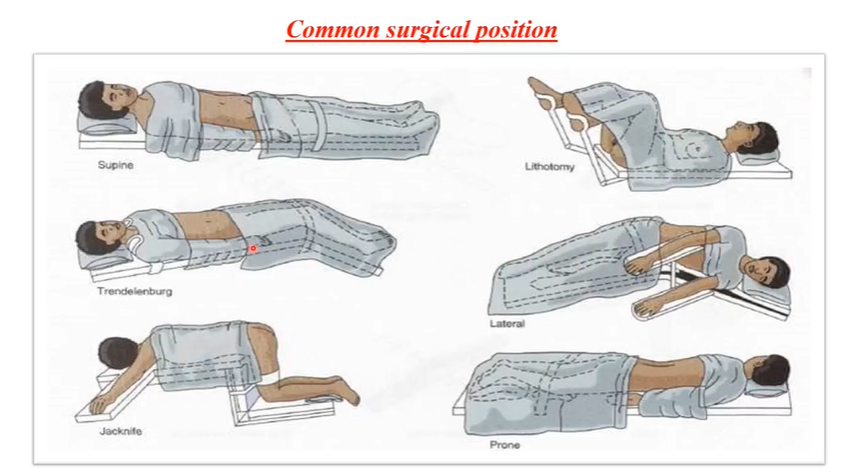
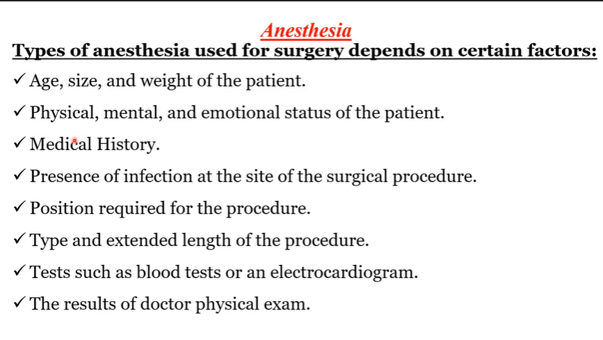
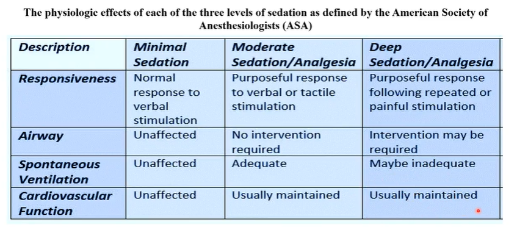
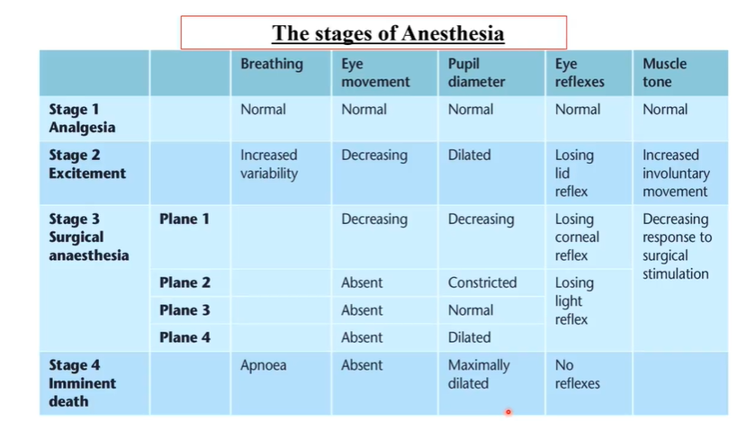

### Intra-operative
اقرا دي, بعض الاجهزه والمعدات اللي بتكون في غرفة العمليات

surgical light focus on patient, surgical x-ray machine, surgical table (patient sleep on), cardiac monitor for continous assessment of patient conditions, pulse oximeter, table of solution and medications (trolley), anesthesia machine, infusion pump, suction machine, blood warmer , ecg machine, oxygen generator, Mechanical ventilator, defibrillator

### OR team
- sterile team
    - surgeon
    - assistant
    - scrub person (nurse)
- non-sterile
    - anesthesiologist
    - circulator (nurse)
    - technicians e:g radiology or biomedical technicians

### some surgical positions

### Nurses in OR

1. **scrub Nurse**

ال scurb nurse ليها دور مباشر فال عمليه فلازم تشتغل ف sterile field يعني هتكون لابسه الجلافز والجاون المعقمين

هي برضو اللي هتحضر وتفتح ادوات الجراحه وتحافظ عليهم فال sterile field و هتناول الادوات دي للجراح 

هتساعد في تحضير المريض سواء فال skin preparatoin او ال drapping او اي شغل مباشر مع المريض

هتتاكد ان كل ال equipments and supplies and instruments موجودين و كاملين

مش هتكون واقفه جمب الجراح مستنياه يطلب اداه معينه لا هي بتتوقع وبتساله وبتديله

هي اللي هتحاقظ على ال sterile field و هتكون متاكده ان محدش يكسره وان الادوات وال supplies كلها موقعتش عالارض مثلا ف لسه محافظه عال sterility بتاعها

هتعد اال instruments and supplies كلها قبل و بعد العمليه

2. **circulating nurse**

دي بتكون شغاله فال environment نفسها بتاعة غرفة العمليات بس مش فال sterile field ف مبتكونش لابسه PPE معقمين

بتتمشى فال OR بتساعد كله , اللي جوا ال OR واللي بره ال OR
هي اللي بتتاكد ان المريض جاهز , ف تتاكد من ال identification band وال consent وانه NPO وكل ده 

بتكون هي حلقة الوصل ما بين ال sterile and non-sterile field يعني لو احتاجنا more supplies in sterile field بتروح هي تجيبهم 

بتفضل تعمل recording and documentation خلال العمليه للي بيحصل , وقت بداية العمليه ونهايته , الخ

بتساعد الفريق يلبسواال PPE المعقم 

بت monitor المريض على طول , علاماته الحيويه , تركيز الاوكسجين فالدم , راحته والوضعيه بتاعته عشان ميقعش وبتراقب برضو ال sterile field 

### Anesthesia 
حاجه مش بتاعتنا بس اقرا النوع والجرعه بيتحددوا بناء على ايه فالسلايد الصغيره دي

### Types of Anesthesia
1. **local anesthesia**: e:g in <mark> dental surgery, breast biobsy, carpal tunnerl release, suturing wounds</mark>
    **Examples**
    - pro<mark>caine</mark> (benzocaine) -> short
    - lido<mark>caine</mark> -> intermediate
    - Bupiva<mark>caine</mark> -> long 

2. **sedation**: 
- it may be minimal, moderate, or deep sedation
- assess its degree by assessing 4 major things
    1. responsiveness
    2. airway
    3. spontaneous ventilation
    4. cardiovascular function

    

    **Examples**
    - **Benzodiazepines**: e:g <mark>midazolam (Dormicum), Diazepam(Valium)</mark>
    - **Opioids**: e:g <mark>Fentanyl, morphine, meperidine(demerol)</mark>
    - **anesthetic/sedatives**: e:g <mark>Thiopentone(pentohal), ketamine, propofol, dexmedetomidine دكس-ميدو-تومي-دين

3. **Regional ansthesia**
e:g <mark>spinal and epidural anesthesia</mark>

4. **general anesthesia**
- **inhaled agents**: e:g <mark>desflurane, isoflurane, sevoflurane<mark> and <mark>nitrous oxide</mark>
- **IV agents**: Barbiturates e:g <mark>amytal, brevital, surital, penthothal</mark> or benzodiazepines e:g <mark>diazepam, larazepam, midazolam, propofol</mark> or short onset and duration Opioids e:g <mark> alfentanil, fentanyl, remifentanil, sufentanil</mark> and longer onset and duration opioids e:g <mark>levorphanol, pethidine, morphine</mark>

> [!NOTE]
> generl anesthesia goal is to achieve the <mark>4-As</mark> which are <mark>lack of <mark>A</mark>wareness, <mark>A</mark>mnesia, <mark>A</mark>nalgesia and <mark>A</mark>kinesia

### **general anesthesia stages**

