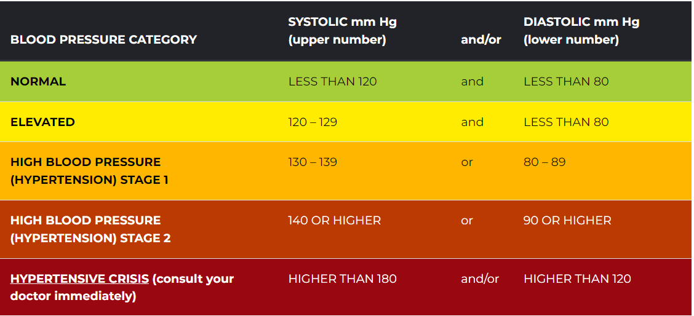

### blood pressure
اعرف انت رايح تقيس الضغط ليه 

احسب ال map بعد ما تقيس 

اسال عن ال absolute contraindications الاول 

هل بيغسل كلى ؟ عشان متستخدمش الايد اللي فيها ال shunt

هل عملت mastectomy

هل في recent surgical wound فالدراع 

بص و اسال عن ال  relative contraindications

هل في lymphedema او paresis او paralysis فالدراع او مركب اي line

اشرحله هتعمل ايه وخد الإذن و اتاكد انه مش قلقان او خايف او كان بيعمل مجهود او شرب سجاير او كافيين او اي ادويه بتاثر عالضغط قبل ما تقيس عالاقل ب نص ساعه

لازم يروح الحمام يفضي المثانه الاول

قعده على كرسي ورجله لامسه الارض وظهره ساند لمدة خمس دقايق

متلفش ال cuff على هدومه ولا تشمر الكم فوق ال cuff

منتصف ال cuff لازم يكون على مستوي ال right atrium اللي هو فال second ICS

مينفعش يتكلم وانت بتقيس

The blood pressure cuff should be inflated 30 mmHg beyond the point where the radial pulse is no longer palpable

Deflation of the cuff should occur in a slow and controlled manner at a rate of 2 to 3 mmHg per second

قيس برضو ال orthostaic hypotension

> [!NOTE]
> the sound you hear when measuring blood pressure is called <mark>Korotkoff sound</mark>
> Thus, the systolic pressure is indicated by the origination of Korotkoff sounds, and their disappearance indicates the diastolic pressure

### The Korotkoff sounds heard when measuring blood pressure are:
- **Phase 1** is a faint but clear tapping sound that gradually increases in intensity
- **Phase 2** is the dampening of this sound, which may be heard like blowing or swishing
- **Phase 3** is when the sharper sounds return that does not have the intensity of phase 1
- **Phase 4** is a well-defined muffled sound that progresses to become soft and blowing
- **Phase 5** is the absence of sounds

> [!IMPORTANT]
> - Medical professionals should be aware of the <mark>auscultatory gap</mark>, which can result in the premature recording of diastolic pressure. In some patients, particularly those with <mark>wide pulse pressure</mark>, Korotkoff sounds can temporarily fade but reappear as the cuff deflates. Medical professionals should thus continue to auscultate over the brachial artery even when Korotkoff sounds disappear to eliminate the possibility of an auscultatory gap. Only the final disappearance of Korotkoff sounds should be used to record the diastolic pressure

> [!TIP]
> - Smoking within 30 minutes of measurement can raise the systolic blood pressure to 20 mmHg, while a distended bladder can increase systolic and diastolic measurements by 10 to 15 mmHg. Sitting in a chair lacking back support can raise systolic blood pressure to 10 mmHg, and a similar increase is observed when both legs are crossed, Cuff placement over clothing can affect measurements by an astonishing 50 mmHg. Talking/listening during measurements can increase systolic and diastolic measurements by 10 mmHg, An improperly sized cuff can affect blood pressure in either direction; a larger cuff results in falsely low measurements, while a smaller cuff results in falsely elevated measurements. Similarly, incorrect arm positioning also results in a bidirectional error; placing the arm below the level of the right atrium results in higher values, whereas placing the arm above the right atrium generates lower values. The vast range of these errors highlights the importance of adhering to the appropriate technique when measuring blood pressure.

### clinical significance
- **Undiagnosed hypertension** places patients at increased risk of developing coronary artery disease, stroke, and end-stage renal disease, among other complications
- **Hypotension** is less common than hypertension and is generally due to an identifiable cause, such as dehydration, illness, or medication side effects, it is a systolic pressure of less than 90 mmHg or a diastolic pressure of less than 60 mmHg
- **Orthostatic Hypotension** Some patients are normotensive at rest but experience symptoms of hypotension when standing. Such orthostatic hypotension is defined by a decrease in systolic blood pressure of 20 mmHg or a reduction in diastolic blood pressure of 10 mmHg after 3 minutes of standing from a sitting or supine position.

### MAP

**2 formulas can be used to calculate MAP**

- MAP = <mark>DP + 1/3 (SP - DP)</mark>
- MAP = <mark>DP + 1/3 (PP)</mark>

### why do we assess blood pressure
- To screen for hypertension
- To monitor the effectiveness of management
- To assess suitability for certain occupations or a sport 
- To estimate cardiovascular risk
- Determining the risk of medical procedures
- Monitoring a patient's ongoing clinical state and deterioration

### contraindications
**Relative contraindications** for taking the blood pressure on the affected arm using a cuff are:
- Lymphedema
- Paresis or paralysis
- Arterial or venous lines, such as venous catheters

**Absolute contraindications** for taking the blood pressure on the affected arm using a cuff are:
- Dialysis shunt
- Recent surgical wounds
- Mastectomy

### reading

