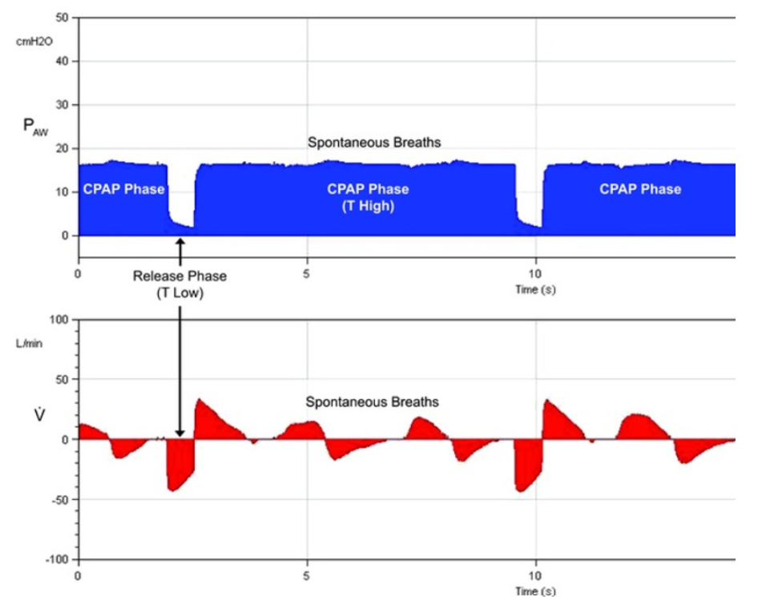

### APRV
APRV (Airway Pressure Release Ventilation) is a form of CPAP, but it differs in that it adds a **timed release** phase while still allowing for **spontaneous breathing**. Let’s break this down to further explain how it works and why it can be advantageous, especially in the prevention of lung injury.

### Key Aspects of APRV:
1. **Continuous Pressure Phase**:
   - In APRV, the ventilator maintains a high continuous pressure (often called **P high**) for a prolonged period. This is similar to CPAP in that it keeps the alveoli (air sacs) open by applying continuous positive pressure to the lungs.
   - The goal of this phase is to **recruit alveoli** (both small distal ones and larger proximal ones) and keep them open, improving gas exchange and oxygenation.
   - The pressure is transmitted to the chest wall, helping to prevent alveolar collapse, especially in the lower parts of the lungs.

   

    Here, P-high represents the CPAP level, and T-high indicates the duration of P-high. During APRV, the CPAP phase (P-high) is periodically released to a P-low for a brief period (T-low), and then the CPAP level is re-established on the subsequent breath. Spontaneous breathing can occur at both pressure levels and is not dependent on time cycling.

2. **Timed Pressure Release**:
   - Unlike pure CPAP, APRV has a brief, controlled release of pressure (called **P low**) at regular intervals. This release allows for partial exhalation, helping to clear out CO₂ while preventing the lungs from collapsing completely.
   - The release phase is **short**, which minimizes the risk of alveolar collapse (atelectasis), as the lungs don’t fully deflate.
   
3. **Prevention of Lung Injury**:
   - **Atelectrauma**: This happens when alveoli collapse and reopen repeatedly with each breath, causing injury. In conventional ventilation modes, especially volume or pressure control, there can be cycles of **recruitment (opening)** and **derecruitment (closing)** of alveoli. APRV avoids this by keeping the alveoli continuously open with prolonged high pressure, minimizing the risk of repetitive opening and closing.
   - **Barotrauma**: This is injury caused by high pressure in the lungs. In APRV, the pressure is applied more gently over time, with fewer sudden, large pressure changes, reducing the risk of barotrauma.
   - **Ventilator-Induced Lung Injury (VILI)**: APRV’s lung-protective strategy—by maintaining alveolar recruitment and preventing over-distention and collapse—can help prevent VILI. The balance between the high and low pressures ensures the lungs remain adequately inflated while allowing for gas exchange.

4. **Spontaneous Breathing**:
   - A key advantage of APRV over other ventilator modes is that it allows the patient to breathe spontaneously throughout both the high-pressure and low-pressure phases. This can improve patient comfort and enhance ventilation, as the diaphragm (the main muscle for breathing) remains active, contributing to better oxygenation and lung function.

### Advantages of APRV in Summary:
- **Continuous lung recruitment**: The prolonged high-pressure phase helps keep alveoli open and well-ventilated.
- **Minimized lung injury**: By avoiding the cyclic opening and closing of alveoli and reducing large pressure swings, APRV minimizes the risk of atelectrauma, barotrauma, and ventilator-induced lung injury.
- **Improved oxygenation**: The sustained alveolar recruitment leads to better oxygen exchange across the lungs.
- **Spontaneous breathing**: APRV supports spontaneous breathing, making it a more comfortable and potentially safer option for many patients.

### How It Differs from Conventional Ventilation:
- In **pressure or volume control** ventilation, there are distinct cycles of inspiration (pressure or volume applied) and expiration (pressure released), which can cause alveoli to collapse and reopen repeatedly, leading to lung injury.
- **APRV**, on the other hand, maintains a higher baseline pressure with brief pressure releases, which reduces alveolar collapse and promotes lung stability throughout the ventilation cycle.

This makes APRV particularly useful in conditions like **acute respiratory distress syndrome (ARDS)**, where lung protection is critical.

Setting up APRV involves adjusting 4 main variables, which include P-high, P-low, T-high, and T-low

### 1. **P-high (High Pressure)**
   - **What it is**: P-high represents the continuous positive airway pressure that keeps the alveoli open, promoting oxygenation. This is analogous to the plateau pressure in volume control ventilation.
   - **How it's set**: Initially, you determine **P-high** using an inspiratory hold maneuver to identify the plateau pressure, which generally ranges between **27 to 29 cm H2O**. In obese patients or those with increased chest wall stiffness, higher P-high values may be needed to ensure proper lung recruitment.

### 2. **P-low (Low Pressure)**
   - **What it is**: P-low is the pressure during the release phase when the ventilator allows for partial exhalation. This phase helps with the removal of carbon dioxide (CO₂).
   - **How it's set**: P-low is usually set to **0 cm H2O**, which allows the lungs to exhale and release CO₂. However, **intrinsic PEEP (iPEEP)**, which is naturally present due to incomplete exhalation, prevents the lungs from fully collapsing to zero pressure during exhalation. The idea here is to avoid complete lung collapse and maintain lung recruitment, thus preventing atelectrauma.

### 3. **T-high (Time High)**
   - **What it is**: T-high determines the duration that the ventilator maintains the P-high (continuous pressure). This phase is crucial for oxygenation as it keeps the alveoli open for a prolonged time, enhancing gas exchange.
   - **How it's set**: Typically, T-high is set to around **4 to 6 seconds** but can be adjusted based on the patient’s needs. The longer T-high is maintained, the more time the lungs spend in an open and recruited state, which benefits oxygenation.

### 4. **T-low (Time Low)**
   - **What it is**: T-low is the brief duration where pressure drops to P-low, allowing for some exhalation and CO₂ elimination. This phase is kept short to avoid alveolar collapse.
   - **How it's set**: T-low is usually set to a brief duration, around **0.5 to 1 second**. The short T-low ensures that alveoli do not completely collapse during the release phase. The goal is to allow enough time for CO₂ to be eliminated while maintaining most of the alveoli in a recruited state.

### Initial Setup Steps:
1. **Post-Intubation**:
   - After intubation, the patient is initially placed on **Assist Control/Volume Control (AC/VC)** until paralysis subsides. This helps stabilize the patient and provides full respiratory support.
  
2. **Inspiratory Hold Maneuver**:
   - Once the patient is stable, you perform an **inspiratory hold maneuver** to determine the plateau pressure, which is used to set **P-high**. This maneuver gives an estimate of the lung's compliance, helping you decide the appropriate P-high.

3. **Obese Patients**:
   - In obese patients, due to increased chest wall stiffness, higher P-high settings may be required to achieve adequate lung recruitment. These patients often need higher pressures to keep the alveoli open.

### Summary of Settings:
- **P-high**: Set using the plateau pressure (typically 27–29 cm H2O).
- **P-low**: Usually set to 0 cm H2O, with reliance on intrinsic PEEP.
- **T-high**: Set between 4–6 seconds to maintain continuous pressure.
- **T-low**: Set between 0.5–1 second to allow brief exhalation and CO₂ elimination.

By carefully adjusting these settings, **APRV** can effectively improve oxygenation while minimizing lung injury by keeping the alveoli open (avoiding atelectasis) and reducing the risks of barotrauma and atelectrauma.

## further explanation of settings

### **T-high and T-low Settings**
1. **T-high**:
   - **Typical Setting**: Generally set between **4 to 6 seconds** to maintain the continuous positive pressure phase, allowing adequate time for alveolar recruitment and oxygenation.

2. **T-low**:
   - **Adjustments Based on Disease Type**:
     - **Restrictive Lung Disease**: T-low is usually adjusted to **0.2 to 0.8 seconds**. In these cases, the lungs may not be able to expand fully due to stiffness, so a shorter release phase helps maintain recruitment while allowing for CO₂ clearance.
     - **Obstructive Lung Disease**: T-low can be set between **0.8 to 1.5 seconds**. Patients with obstructive lung diseases, such as COPD or asthma, often have increased airway resistance. A longer T-low helps facilitate exhalation of trapped air while still promoting lung recruitment.

### **Flow-Time Waveform Monitoring**:
- **Importance of Monitoring**: Examining the **flow-time waveform** on the ventilator is crucial to setting T-low accurately. 
  - **Optimizing T-low**: Ideally, T-low should be set to approximately **75% of the peak expiratory flow rate (PEFR)** to ensure that the patient can exhale adequately during the release phase without leading to significant airway obstruction or incomplete exhalation.
  - **Graph Interpretation**: The PEFR curve can help visualize the patient’s ability to exhale effectively, guiding the clinician to adjust T-low to achieve optimal ventilation. 

### **Continuous Monitoring and Readjustment**:
- **Dynamic Adjustment**: As lung recruitment progresses, continuous monitoring of the patient’s respiratory mechanics and waveforms is essential. T-low may need to be readjusted to maintain the target of 75% of PEFR for optimal ventilation.
- **Patient Comfort**: Patient comfort is also a key consideration. If the patient experiences discomfort or dyspnea, adjustments to T-low and T-high may be necessary to optimize ventilation and improve overall comfort.

### **Titration of FiO2**:
- **Oxygen Management**: During APRV, the fraction of inspired oxygen (FiO2) should be titrated downward gradually as the patient’s oxygenation improves and comfort levels permit. 
  - **Oxygen Saturation Goals**: The goal is to maintain adequate oxygen saturation levels (usually aiming for SpO2 > 92% or as indicated by clinical guidelines) while minimizing the risk of oxygen toxicity.
  - **Gradual Reduction**: As the patient stabilizes and shows signs of improved lung function and oxygenation, it’s crucial to reduce FiO2 gradually to prevent abrupt changes that could affect the patient’s respiratory status.

### Summary:
- Setting **T-high** between **4 to 6 seconds** allows for adequate recruitment, while **T-low** should be tailored based on the type of lung disease (0.2 to 0.8 seconds for restrictive diseases and 0.8 to 1.5 seconds for obstructive diseases).
- Monitoring the flow-time waveform is vital for optimizing T-low, ensuring it’s around **75% of PEFR**.
- Continuous assessment of lung recruitment and patient comfort is necessary, along with careful titration of **FiO2** to support optimal oxygenation while minimizing risks.

These considerations make APRV a flexible and effective mode of ventilation, especially for patients with challenging respiratory conditions. If you have any more questions about APRV, specific case applications, or further clarifications, feel free to ask!

### importants
important aspects of APRV (Airway Pressure Release Ventilation) related to spontaneous breathing, hypoxemia management, and hypercapnia.

### Spontaneous Breathing and Pressure Support
1. **Importance of Spontaneous Breathing**:
   - Spontaneous breathing is critical in APRV because it enhances patient comfort, promotes diaphragm use, and improves overall lung mechanics and gas exchange. This can lead to better ventilation and oxygenation.

2. **Counteracting Endotracheal Tube Resistance**:
   - Providing a slight amount of **pressure support** or utilizing **automatic tube compensation (ATC)** helps counteract the resistance caused by the endotracheal tube. This ensures that the work of breathing is reduced, allowing patients to breathe more easily against the resistance of the tube.

### Addressing Hypoxemia in APRV
1. **Increasing P-high and T-high**:
   - If a patient experiences **hypoxemia** (low blood oxygen levels) while on APRV, the initial response is to increase the **P-high** setting. This elevates the continuous pressure, enhancing lung recruitment and improving oxygenation.
   - **Increasing T-high** can also help by prolonging the time spent at high pressure, allowing more time for alveoli to be ventilated and perfused.

2. **Shortening T-low**:
   - Another strategy to correct hypoxemia is to shorten **T-low**, which allows for quicker cycling back to the high pressure. This can help maintain a higher baseline lung volume, supporting oxygenation.

### Permissive Hypercapnia and Management
1. **Permissive Hypercapnia**:
   - APRV allows for **permissive hypercapnia**, meaning that some degree of elevated carbon dioxide (CO₂) levels in the blood is tolerated, especially in patients with acute lung injury. This is due to the focus on lung protection and preventing ventilator-induced lung injury.
   
2. **Managing Excessive Hypercapnia**:
   - If hypercapnia becomes excessive, it can be managed by:
     - **Reducing Sedation**: This allows the patient to take more spontaneous breaths, enhancing CO₂ clearance.
     - **Increasing P-high and T-high**: These adjustments can improve ventilation and gas exchange, helping to reduce CO₂ levels.

3. **Increasing T-low**:
   - While increasing **T-low** may help alleviate hypercapnia, this approach has limitations. 
     - APRV relies on **intrinsic PEEP (iPEEP)** during the P-low phase to maintain lung recruitment. 
     - If T-low is increased significantly, it can reduce iPEEP, which may lead to **derecruitment** of alveoli, undermining the very benefits of APRV that aim to keep the lungs open.

### Summary:
- **Spontaneous Breathing**: Crucial in APRV, supported by pressure compensation to overcome endotracheal tube resistance.
- **Hypoxemia Management**: Addressed by increasing P-high and T-high, or shortening T-low for improved oxygenation.
- **Hypercapnia Management**: Permissive hypercapnia is tolerated, but if excessive, it can be managed by reducing sedation and adjusting pressure settings.
- **T-low Considerations**: Increasing T-low may reduce iPEEP and lead to derecruitment, so this strategy must be used cautiously.

This nuanced approach in APRV helps tailor ventilation to meet individual patient needs while maximizing lung protection and comfort. If you have further questions or need clarification on specific management strategies or clinical scenarios, feel free to ask!
