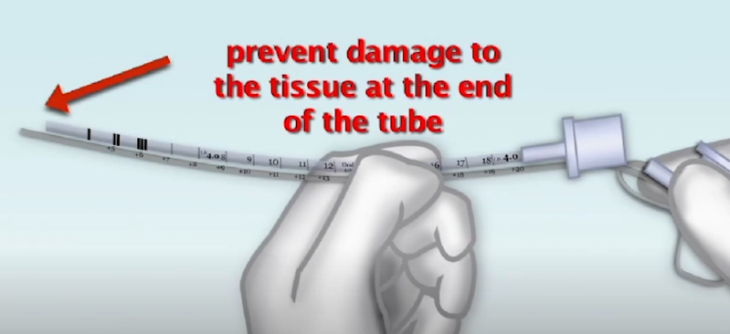

### tube suctioning
watch [this](https://youtu.be/IftM_1TNaWE?si=OBFEDSy30bO__ALg)

### indications
- presence of secretion in tube or in lungs (crackels)
- increase work of breating (hypoxia)

### contraindication
- pulmonary hypertension (relative)
- severe respiratory disease may experience significant clinical decline when performing this procedure (hypoxia, hypercarbia, change in v/s)

### equipments
- suction catheter
- suction source with a receptacle وعاء
- oxygen source
- Manual ventilationo bag and mask with monometer
- cardiac monitor
- PPE (esp. mask with a shield)

### procedure
1. line up the suction catheter with ETT that is of the same size of that of the patient to know exactly the depth of insertion, add 1 cm more 

2. prepare patient
> [!NOTE]
> little babies may need sedation analgesia to prevent accedintal extubation
- explain procedure for older children
- use sterile technique (sterile gloves and sterile catheter)
- hyperoxygenate patient with 100% O2 via MRB
> [!caution]
> - catheter pressure for infants is no more than 80 mmHg
> - for older may reach to 120 mmHg
- clog سد the suction catheter and insert to the desired depth (the depth you already set from point one)
- suction no more that 10 sec at a time while your eyes on the monitor (O2 saturation)
- note amount, color, consistency, odor of secretion

### Complications
1. unplanned extubation -> sedation
2. tissue trauma to tracheal -> don't insert catheter more than 1cm longer that the ETT
3. bronchospasm and desaturation or brady cardia -> your eyes on monitor, stop immediately if happend and hyperoxygenate
4. infections -> use sterile technique

### assess and monitor
- O2 saturation
- heart rate
- blood pressure
- lung sounds
- patient comfort before during and after suction

### documentaion
- reason for suction
- date and time
- characteristics of secretions (amount, color, consistency, odor)
- v/s before, during and after procedure
- response and any adverse reaction
