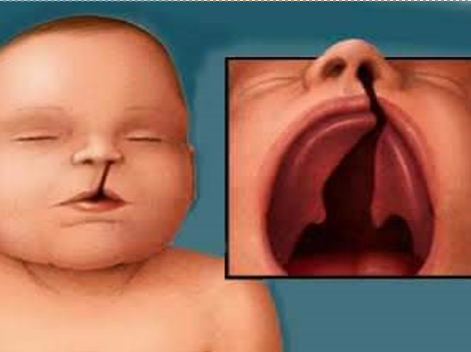
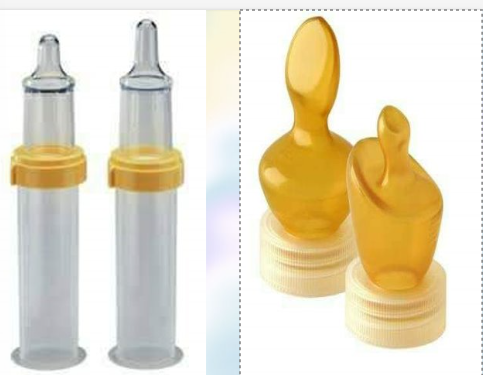
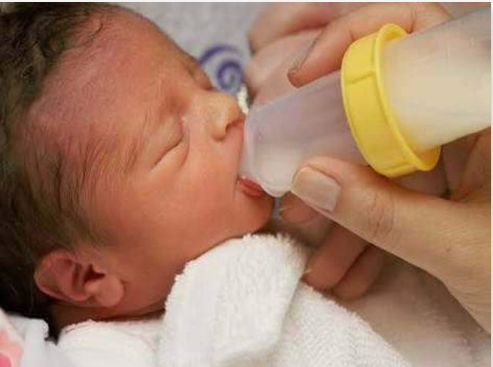
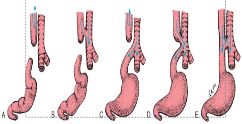
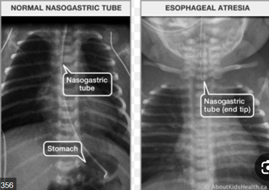

# Congenital anomoly

> [!IMPORTANT]
> - children have greater metabolic rate than adults -> <mark>need more feeding</mark> and also <mark>heal more quickly</mark>
> - fluid loss is more serious in children so <mark>monitor Intake-Outputs </mark>
> - children need <mark>less analgesics</mark>
> - can become hypothermic very easily so <mark>warm baby</mark>
> - <mark>heated portable incubator</mark> should be used to transfer children

### general Pre-Op care of children

كاتبلك بس النقاط اللي ليها علاقه بالاطفال او فيها اختلاف عن الكبار, باقي التحضيرات شبه الكبار عادي

- NPO <mark> 3-4 hours</mark> for children <mark>younger than 1year</mark>
- free of Respiratory complications and malnutrition (Except in emergencies)
- make child wear gown and under pants only
- check mouth for loose teeth and clean nostrils 
- allow him to take his favorite toy with him🥹😂💚
- allow parents to accompany children to operation site

### general Post-Op care
- assess general condition, V/S (hypothermia?)
- assess ABC and keep him warm
- alert children -> put on his side
- observe and assess all connected devices to the children, amount of drainage, dressing coditions, etc..
- restraint and IV fluids
- pulmonary hygeine (physiotherapy, positioning)
- tactile stimulation to reduce pain (massage -> light gentle strokes), skin to skin contact, etc..
- refelxology technique to reduce pain, it's applying pressure to specific points on the feet, hands, or ears, known as reflex points.(طريقته ف اخر الصفحه لو مهتم تعرف)
- connected devices care
- monitor signs of complications (skin color, temperature, signs of shock)
- early manipulation for older children, for younger frequent positioning and skin care

## gastrointestinal anomalies
### 1. anomalies of mouth
1. **cleft Lip**
  - fissure in upper lip, may be unilateral or bilateral

  

  

2. **cleft palate**
  - incomplete fusion of palatal
  - in soft or hard palate or both
  - may have cleft lib also

  

### Nursing
1. **altered nutrition** <mark>(priority)</mark>
    - if small defect => small amount of breast or bottle feeding more frequentمغ, semi fowler with frequent eructation, anي put on right side after feeding
    - large defect => use syringe dropper to drop small amount of milk in baby's side of the mouth or use special bottle fedding

    

    

    

    - gavage feeding lastly if baby can't suck at all when the defect is severe
2. **altered parenting** (knowledge deficit)
    - help parents to accept child
    - envolve parents in care
    - inform them about diagnosis and operation
    - introduce them to a family whose baby underWent the same surgery successfully
    - teach them baby's home care after surgery
3. **high risk for infection**
    - restrain hand to avoid itching on site
    - clean mouth form milk

## post op care
- NO prone position to avoid trauma to the surgery site
- NO milk immediately after operation (curd formation source of infection)
- restrain (elbow or jacket method)
- small frequent meal with eructation in semi setting
- observe the child
- no pacifier or tooth brush on mouth or suction (suction by doctor order after surgery)
- Health teaching about home care
    - food must be watered down or eaten through a cup. Straws are generally not safe
    - you may use a special bottle or syringe for feeding your baby formula or breastmilk.
    - Your child should only be given soft or mashed-up foods (nothing crunchy or hard). Spoon-feeding your child during their recovery is usually OK.
    - Stitches should dissolve within one to two weeks of surgery, Exposed bone on the sides of their palate is normal and will fill in on its own. A small amount of bleeding (in saliva or mucus) is expected. You can expect your child’s mouth to be swollen for at least one week.
    - You can expect your child to feel some degree of pain for up to two weeks. The pain could affect their eating, drinking and sleeping.
    - Your child may snore and sound congested for several weeks.
    - keep incision clean using warm water
    - call doctor if fever > 38.5, bleeding from nose or mouth (pink mucus and saliva are normal), pus from the incision, Signs of dehydration, like no tears when crying, sunken eyes, dry mouth or not urinating enough (at least one wet diaper every six hours), Any redness or severe swelling at the incision site, The incisions open or the stitches are loose.

## anomalies of esophagus

### 1. **esophageal atresia with tracheo-osophageal-fistual** (TOF) 
  - esophagus is not complete (don't reach the stomach)
  - fistula is abnormal opening between two passages (here the trachea and esophagus)
    
    **Types**

    

    - atresia alone -> <mark>Type-A</mark>
    - atresia with proximal fistula -> <mark>Type-B</mark>
    - atresia with distal fistula -> <mark>Type-C</mark>
    - atresia with proximal and distal fistula -> <mark>Type-D</mark>
    - tracheo-esophageal fistula -> <mark>Type-E</mark>

    - **it represents by**
        - <mark>excessive salivation and regurgitation after feeding</mark>
        - <mark>coughing, shocking and cyanosis</mark> especially in type B, C, D and E
        - <mark>abdominal distension and respiratory distress</mark> (Type C, D, E) and
        - <mark>pneumonia (e:g acid pneumonitis or from food particles)</mark>
    
    **diagnosed by**

    

    - insertion of gastric tube -> GT coiled back and get out of the mouth
    - x-ray with the gastric tube shows blind end

> [!caution]
> no contrast meduim is used when studying esophagus to avoid barium aspiration

### Nursing
1. **high risk of aspiration**
2. **altered nutrition**
3. **impaired skin integrity**
4. **risk for infection** 
5. **parental anxiety**
6. **knowledge deficit**(surgery, homeCare, followUp)
    
### pre-OP
- cotinous suction
- NPO, IV fluids (TPN)
- warm him to avoid hypothermia
- o2 if distressed
- semi sitting
### PostOP
- v/s, suction as needed and doctor order
- NPO, IV fluids and warm him
- monitor signs of complications
- gastrostomy is for fedding 
- Gastric tube is for drainage(don't feed baby using it)
- use pacifier, and gradual oral feeding when doctor order to start
- health teaching about the above in the home (gastrostomy care, feeding)

## anomalies of stomach and duodenum

### 1. **hyperTrophic pyloric stenosis**

- <mark>projectile non-bilious vomiting</mark> start 2nd to 8th week
- <mark>olive like mass</mark> in right of the umbilicus
- peristalsis of stomach may be visible

> [!NOTE]
> vomiting may lead to dehydration, constiption, skin problem, malnutrition and lethargy

**diagnosed by:** clinical manifestation and US

**Treatment** -> pyloromyotomy

### Nursing
- fluid volume dificit 
- altered nutrition
- impaired skin
- infection risk
- knowledge deficit about need of surgery

### PreOp
- NPO, semi setting, IV fluids and electrolytes monitor
- v/s, assess vomitus and stool
- gastric lavage using NS
- skin and mouth care and change position
- weigt daily and measure intakes and outputs

### PostOp
- NPO, IV fluids(TPN)
- signs of complications (shock, abdominal distension)
- educate parent about care

## Intestine anomalies

### 1. **hirshsprung's (aganglionic megacolon)**

- **manifestation in newborn**
    - failure to pass meconium within 24 hours
    - refusal to feed
    - bilious vomiting (green or yellow)
    - abdominl distension
- **in infancy**
    - constipation
    - abdominal distension
    - inadequate weight gain
    - episode of diarrhea and vomiting
    - signs of enterocolitis

> [!NOTE]
> signs of enterocolitis include <mark>explosive, watery bloody diarrhea, fever and lethargy

- **in childhood**
    - constipation and fecal impaction
    - abdominal distension
    - <mark>Ribbon-like</mark>, foul smelling stools
    - easily palpable fecal mass
    - malnutrition

    **diagnosed by**
    - rectal exam -> empty rectal and leakage of liquid stool
    - barium enema -> coin shape intestine
    - rectal biobsy (sure sign)
    - anorectal manometry

### treated by 2 surgical stages
1. colostomy to remove stool
2. resection and anastomosis

#### preOp
V/S, NPO, IV fluids, semi setting, abdominal girth measure, o2 thearpy, Inputs and Outputs, colonic lavage

#### PostOP
general care, colosomy and pouch care, educate parent

### intussusception

- <mark>acquired</mark> congenital anomaly
- invagination  of intestine
- occur mostly in weaning period, generally can occur any time from 3-Month - 5-Years

**manifested by**
- sever sudden abdominal pain(draws knees into chest) and appear normal between attacks
- red currant jelly stool
- palpable sousage like mass in upper right quadrant
- empty right lower quadrant (dance sign)

> [!caution]
> monitor signs of complications like perforation peritonitis and shock

**diagnosed by**
- US -> Target sign(6 layer)
- barium enema-> crescent or napoleon cap

### treatment
- hydrostatic reduction (barium enema)
- simple reduction by milking (surgical)
- resection and end to end anastomosis

### Pre-Op
- NPo , iv fluids
- Naso gastric suction
- antibiotic if preforation

### post-Op
- npo, iv flulids
- if barium -> high fluids and observe it in stool
- kidney function, in and out
- risk of recurrent

------------

**Reflexology** is a therapeutic practice that involves applying pressure to specific points on the feet, hands, or ears, known as reflex points. These reflex points correspond to different organs and systems within the body. The idea is that stimulating these points can help to improve overall health and well-being by restoring balance and promoting healing.

#### **1. Basic Foot Reflexology**

**Feet are the most common area for reflexology in babies.**

- **Preparation**:
  - Ensure the baby is calm and comfortable, either lying on their back or in a relaxed position.
  - Wash your hands and make sure your fingers are warm to avoid startling the baby.

- **Technique**:
  - Use your thumb or fingers to apply gentle, circular pressure to the soles of the baby’s feet.
  - Start with light pressure and gradually increase as the baby becomes more accustomed to the sensation.
  - Focus on specific reflex points, such as:
    - **Toes**: Correspond to the head and sinuses.
    - **Ball of the Foot**: Corresponds to the chest and lungs.

    

    - **Arch of the Foot**: Represents the digestive organs, including the stomach and intestines.
    - **Heel**: Linked to the lower back and pelvic area.

- **Duration**: 
  - Spend about 1-2 minutes on each foot. If the baby seems to enjoy it, you can extend the session.

#### **2. Hand Reflexology**

**Hand reflexology can also be effective, especially for calming and soothing**:

- **Technique**:
  - Hold the baby’s hand gently and use your thumb to apply light, circular pressure to the palm and fingers.
  - Focus on:
    - **Fingers**: Correspond to the head and brain.
    - **Palm**: Linked to the chest and respiratory system.
    - **Base of the Hand**: Associated with the digestive organs.

- **Duration**: 
  - Similar to foot reflexology, spend about 1-2 minutes on each hand.

#### **3. Ear Reflexology**

**Ear reflexology involves stimulating points on the ears**:

- **Technique**:
  - Gently massage the outer ear and earlobes using light pressure.
  - Focus on areas like:
    - **Ear Lobe**: Linked to the internal organs.
    - **Outer Rim**: Represents various body systems, including the digestive and respiratory systems.

- **Duration**: 
  - Spend about 1-2 minutes on each ear.

### **Tips for Effective Reflexology with Babies**

1. **Gentle Pressure**:
   - Always use gentle pressure, as babies have delicate skin and tissues. The goal is to soothe and comfort, not to cause discomfort.

2. **Observe Reactions**:
   - Pay attention to the baby’s reactions. If they seem distressed or uncomfortable, stop the session and try again later or with lighter pressure.

3. **Create a Relaxing Environment**:
   - Ensure the baby is in a calm and relaxed environment. Soft music, a quiet room, or dim lighting can help create a soothing atmosphere.

4. **Use a Gentle Touch**:
   - Your touch should be soft and reassuring. Avoid applying too much pressure or using rough techniques.

5. **Consistency**:
   - Regular sessions can help build the baby’s familiarity with reflexology and its benefits. Short, frequent sessions are more effective than longer, less frequent ones.

### **When to Avoid Reflexology**

- **If the baby has any skin infections, rashes, or wounds** on the feet, hands, or ears.
- **If the baby is experiencing severe pain** or has a medical condition that may require specific treatment.
- **If the baby shows signs of discomfort or distress** during the session.

