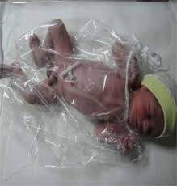
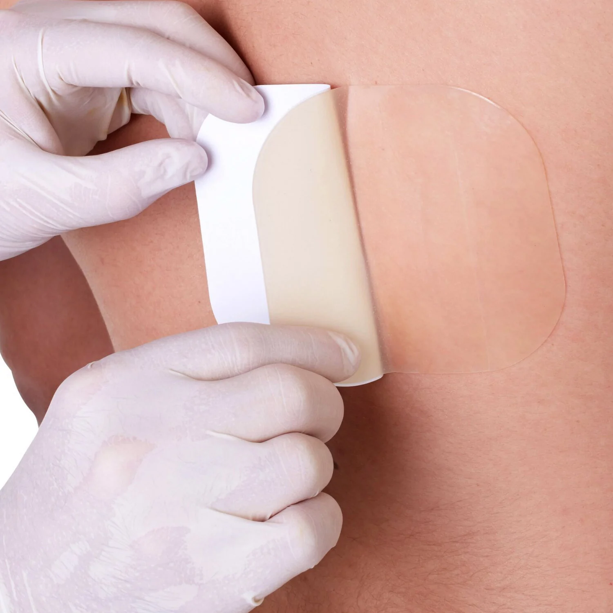

### High risk neonate

### prematurity

- <mark>Low birth weight</mark> < 2500 gm
- <mark>very low birth weight</mark> < 1500 gm
- <mark>extremely low birth weight</mark> < 1500 gm

----
- **Extremely preterm**: <mark>< 28 weeks</mark>
- **very preterm**: <mark>28 weeks - 31 weeks and 6 days</mark>
- **moderately preterm**: <mark> 32 - 33 weeks and 6 days</mark>
- **late preterm**: <mark>34 weeks - 36 weeks and 6 days</mark>
---
> [!NOTE]
> if neonate weight's lies below 10th percentile the neonate weight is <mark>small for gestational age</mark>, if above the 9th percentile weight is <mark>large for gestational age </mark>, if lies between 10th and 9th percentile <mark>appropriate for gestational age</mark>

**symmetric IUGR(intra utrine growth retardation)**
- growth of weight, length, head circumference are all affected(not normal) and lies below the 10th percentile

**Asymmetric IUGR**
- one of the weight, length or head circumference is normal, and the remaining two lies below the 10th percentile

> [!NOTE]
> usually the head circumference is the normal parameter

---

**level-1 facility:** (feeder and grower room)
- it is for stable late preterm
- neonate just need feeding and observation and appropriate care

**level-2 facility**:
- for moderately ill neonate
- weight is more than 1500 gm and born at more than 32 weeks
- have medical condition

**level-3 facility**:
- complex condition
- requires MV and CPR and advanced care, continious assessment and observation

----
### Nursing assessment of neonate
- appearance, posture, deformities, color
- V/S, apical pulse
- Intake and outputs
- **respiratory assessment**
    - accessory muscles usage?
    - suprasternal retractions?
    - Respiratory rate, and breathing sounds
- **cardioVascular assessment**
    - heart rate, rhythm, apical pulse
    - color, capillary refill
- **GIT**:
    - bowel sound
    - signs of regurgitation and GRV
    
>   [!NOTE] (regurgitation is when you eructate baby and 5 - 10 cm of milk comes out of the mouth) it differs from vomiting.

    - presence of abdominal distension?
    - pass mocenium? stool assessment

- **neurological-musculoSkeletal assessment**:
    - infant's position (flexed, extended)
    - infant's movements (random, twitching)
    - level of activity
    - **assess reflexes**
        - **moro reflex**

        https://youtube.com/shorts/svCEWIEqVDg?si=w3_-d3MgXYX4ubgY

        - **root and sucking reflex**

        https://youtu.be/_Vs7_aHfOy8?si=-e_IPlhMdCN_Jw4h

        - **galant reflex**

        https://youtu.be/Yy9R3pF1rJc?si=EZQLgw0tB47z7N4h

        https://youtu.be/06GHeYs0myA?si=haGW5c4n0HyUPAQL

        - **pabiniski**

        https://youtu.be/b2QKXOzD8sA?si=-Q8ZCQgA71EcOPTk

> [!NOTE]
> - it term infants normal temperature is <mark>36.5-37.5</mark>
> - in preterm <mark>36.8-36.9</mark>

# Nursing for preterm
- maintain temperature -> icubator or radiant warmer, if none exists just warm him as possible as you can
- adjust humadity in all <mark>< 31 weeks</mark> preterms at <mark>85%</mark>
- cover his head
- plastic wraps or bags for extremely preterm

- measure body temperatrue <mark>q15-30min</mark>
- skin to skin contact for stable preterm
- introduce trophic feeding
- non-nutritive sucking 

> [!TIP]
> - for preterm, expressed breast milk feeding is easier than normal breast feeding through use of <mark>small, soft nipples with large holes</mark>
> - so it's preferable for him than breast feeding until he matures

- gavage feeding:
- monitor intake and outputs, wight baby daily and maintian hydration
- assess signs of extravasation in cannula sites as baby's tissue is easily damaged
- electrolyes imbalance and hyper or hypo glycemia may manifest as <mark>alterations in alertness, activity level and behavior, tremors and seizures</mark>
- assess umbilical or venous catheter patency
- frequent hand wahsing to prevent infection
- no alkaline based soap acid mantle is used
- all skin products alcohol, chlorhexiding, iodine with cautoin and rinsed afterward
- pectin barriers and hydrocolloid is useful
    - hydrocolloid is a long lasting neonatal adhesive that minimizes skin damage.

    

    - put pectin-based barrier put under advesive tape provides effective adhesion for certain appliances and protects neonatal skin from damage caused by tape removal.

    

> [!IMPORTANT] 
> - decrease noise as possible 
> - prone position imporove oxygentation, better-tolerated feeding, and preserve sleep-rest pattern
> - darken the room at night and put eye patches over eyes
> - don't interupt baby's sleep for <mark>at least 50 min</mark>
> - blanket swaddling and nesting (helps new born maintain an attitude of flexion when prone or sidelying)

